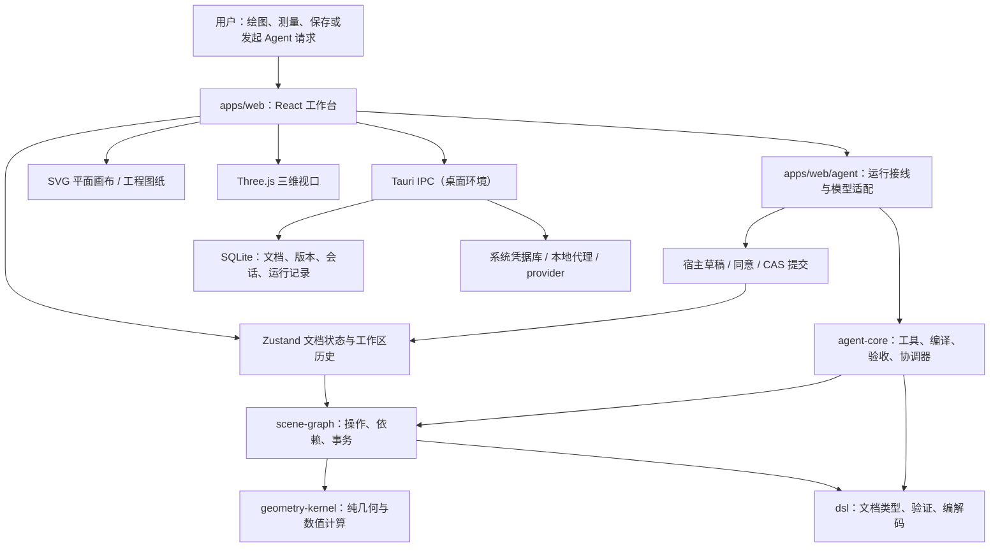
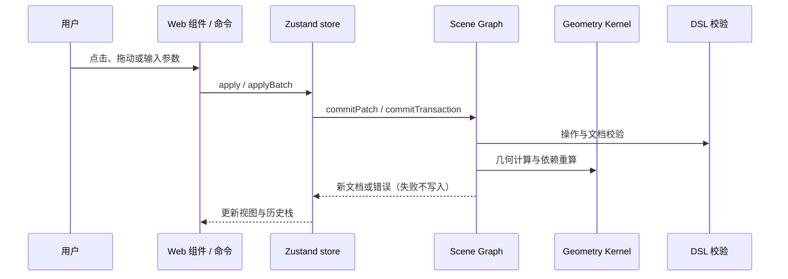

# MathCanvas 架构与技术审查

> 核查基线：`main` 分支提交 `7ff6322`（桌面版 v3.0 发布提交），2026-09-29；同时核对工作区中尚未提交的 README 调整。本文以仓库中的源码、依赖清单、构建配置与测试入口为依据，不把历史进度记录当作当前运行结果。
>
> 范围：仓库内约 790 个受版本管理的文件，按目录盘点并沿关键数据流抽查入口、接口、状态边界与相应测试；**不表示逐行审计了每个文件**，也不等于安全渗透测试或真实模型质量评测。`node_modules/`、构建产物、临时日志不作为产品源码审查对象。

> **时间边界（2026-10-06）**：本审阅对应 2026-09-29 的 `7ff6322`，不是最新 Agent/V0a 发布结论；当前能力与门禁见 [当前状态](current-status.md) / [作图题任务进度](agent-next-round-progress.md)。

## 1. 一图读懂

MathCanvas 是 **npm workspaces 单仓库**：浏览器应用和 Tauri 桌面壳复用同一前端，几何文档及计算分别落在独立的 TypeScript 包中。前端可手动编辑，也可走 Agent 规划与人工确认路径。桌面版在此基础上提供 Rust 系统能力、凭据库、SQLite 仓储和模型网络转发。

**依赖方向**：`dsl` 定义数据契约，`geometry-kernel` 提供计算，`scene-graph` 把操作和计算应用于文档，`agent-core` 组织受限的自动化，`apps/web` 负责交互和装配，`apps/desktop` 提供桌面基础设施。几何规则应留在内核或场景层，而非散落在 React 组件中。证据：[包依赖](../package.json)、[各包清单](../packages/agent-core/package.json)、[场景入口](../packages/scene-graph/src/index.ts)、[前端入口](../apps/web/src/main.tsx)。

## 2. 技术栈和运行边界

| 层 | 使用的技术 | 在本项目中的用途 |
| --- | --- | --- |
| 单仓库与语言 | npm workspaces、TypeScript、ES2022 | `apps/*` 与 `packages/*` 的开发、构建与类型契约；根目录 `tsconfig.base.json` 开启 strict。 |
| 浏览器 UI | React 19、React DOM、Vite 7、Zustand 5 | UI 组件、工作区路由、全局文档状态和增量开发服务器。 |
| 平面/立体呈现 | SVG、Three.js 0.186 | 平面图元和图纸采用 SVG；立体视口采用 Three.js/WebGL。 |
| 文件与导出 | `.mgeo` 编解码、浏览器文件 API、pdf-lib | 保存/打开几何文档，以及 SVG、PDF 等工程导出路径；详见 [导出模块](../apps/web/src/persistence/engineeringExporters.ts)。 |
| 桌面平台 | Tauri 2、Rust 2021、WebView | 同一前端运行在桌面窗口，系统能力通过命名 IPC 暴露；CSP 限制资源来源。 |
| 桌面数据与网络 | rusqlite + bundled SQLite、keyring、Tokio、Axum、Reqwest + rustls | 文档快照、会话与运行记录，系统安全存储，以及受约束的本地代理/provider 转发。 |
| 质量工具 | Vitest 4、Testing Library、Playwright、ESLint、`tsc`、`cargo test` | 单元/组件、浏览器端到端、静态检查和 Rust 侧回归。 |

版本数字取自 [根清单](../package.json)、[Web 清单](../apps/web/package.json)、[Tauri 清单](../apps/desktop/package.json) 与 [Cargo 清单](../apps/desktop/src-tauri/Cargo.toml)，表示清单中的主版本/约束，不表示已做兼容性认证。浏览器端无需 Rust 或模型服务即可使用手动画布；桌面构建另需 Rust/Tauri 环境。[v3.0 发布说明](release/v3.0.md) 记录了已构建的桌面产物和未完成的验收；它不意味着所有 Agent 发布门禁都已通过。浏览器草稿用 `localStorage`，不是云端账号存储或跨设备同步。

## 3. 目录职责和关键接口

| 位置 | 主要职责与可追溯入口 |
| --- | --- |
| [`apps/web/src/App.tsx`](../apps/web/src/App.tsx) | 顶层工作台，组织模块、当前文档、工具命令、属性面板、2D/3D/制图视图。 |
| [`apps/web/src/store.ts`](../apps/web/src/store.ts) | Zustand 文档状态，`apply`/`applyBatch`、`undo`/`redo`、跨工作区文档；Agent 通过 `commitCandidate` 写入一步历史。 |
| [`apps/web/src/components/GraphicsView.tsx`](../apps/web/src/components/GraphicsView.tsx)、[`threeScene.tsx`](../apps/web/src/threeScene.tsx) | 平面 SVG 与 Three.js 场景；拖动过程可先预览，结束时再提交一次操作。 |
| [`packages/dsl/src/types.ts`](../packages/dsl/src/types.ts)、[`schema.ts`](../packages/dsl/src/schema.ts)、[`codec.ts`](../packages/dsl/src/codec.ts) | `GeometryDocument` / 图元联合类型、结构验证、`.mgeo` 的序列化与兼容解码。 |
| [`packages/geometry-kernel/src/index.ts`](../packages/geometry-kernel/src/index.ts) | 交点、圆锥曲线、函数采样/微积分、三维构造/截面/布尔/投影/测量、动态宿主约束与响应式求值。 |
| [`packages/scene-graph/src/operations.ts`](../packages/scene-graph/src/operations.ts)、[`transactions.ts`](../packages/scene-graph/src/transactions.ts) | 域操作、依赖重算、批量原子事务、内容指纹、语义 diff。 |
| [`packages/agent-core/src/coordinator.ts`](../packages/agent-core/src/coordinator.ts)、[`toolRegistry.ts`](../packages/agent-core/src/toolRegistry.ts) | Agent 状态机、工具可见性、草稿校验与用户确认之前的门禁；核心逻辑不直接依赖 Web UI 或 Rust 网络。 |
| [`apps/web/src/agent/agentRunner.ts`](../apps/web/src/agent/agentRunner.ts)、[`agentRuntime.ts`](../apps/web/src/agent/agentRuntime.ts) | 选择本地/真实模型规划器，装配观测、草稿和宿主端口，将事件映射到界面。 |
| [`apps/desktop/src-tauri/src/lib.rs`](../apps/desktop/src-tauri/src/lib.rs) | 初始化 Rust 托管状态并注册 Tauri 命令；`repository/`、`providers/`、`proxy/`、`secrets/` 分别处理存储、模型、代理和凭据。 |

### 3.1 几何文档、编辑与撤销

`GeometryDocument` 包含 `workspace`、`revision`、`primitives`、参数/测量与元数据，传统画布的**文档**和 UI 偏好/临时拖动预览分离。`Workspace` 类型覆盖 `conics`、`geometry3d`、`cad`，也保留 `calculus` 兼容值；不能把 UI 标签与底层 ID 混为一谈。[文档类型](../packages/dsl/src/types.ts)、[状态管理](../apps/web/src/store.ts)。

手工操作经 store 调用 `commitPatch` 或 `commitTransaction`。事务按顺序检查并应用域操作，以便后一操作引用前一操作创建的对象；任意步骤失败则返回原文档，成功后再校验结果文档并计算内容指纹。`applyBatch` 只占一步撤销，历史有上限；派生对象由场景依赖和重算链更新。[事务代码](../packages/scene-graph/src/transactions.ts)、[操作执行](../packages/scene-graph/src/apply.ts)、[依赖图](../packages/scene-graph/src/graph.ts)。

### 3.2 浏览器与桌面持久化

浏览器把 `.mgeo` 当作可导出的文档格式，通过文件选择器打开；本地草稿与工作台偏好保存在浏览器 `localStorage`，启动时尝试恢复。浏览器侧没有远端账号、服务端同步和自动云备份。[浏览器草稿](../apps/web/src/persistence/draftStorage.ts)、[编解码](../packages/dsl/src/codec.ts)。

桌面侧通过 Tauri 命名命令访问 Rust：SQLite `projects.db` 存文档 head、快照、提交、会话与运行记录；附件字节单独存放在 `attachments/`。仓储使用 `(project_id, document_id)`、epoch/generation、内容哈希与幂等键限制旧写入重放；`documentPersistence` 区分普通保存与导入/换代，避免在途旧保存覆盖刚打开的文档。SQLite 迁移由 `PRAGMA user_version` 逐步向前执行。[Rust 初始化](../apps/desktop/src-tauri/src/lib.rs)、[迁移](../apps/desktop/src-tauri/src/repository/migrations.rs)、[前端持久化适配](../apps/web/src/services/documentPersistence.ts)。

### 3.3 Agent 自动化与安全边界

- 规划器可由 `agentRunner` 选本地确定性实现或已配置且可用的 provider。模型请求可通过原生工具调用反复读取场景，最后用 `plan.set_plan` 交计划；工具定义由 `toolRegistry` 控制模型可见集合。**模型不直接获取确认提交工具**。[规划选择](../apps/web/src/agent/agentRunner.ts)、[工具目录](../packages/agent-core/src/toolRegistry.ts)、[模型调用](../apps/web/src/agent/modelPlanner.ts)。
- 动作在 `agent-core` 被解析、审计、引用解析、几何语义校验并编译为隔离草稿；协调器和宿主通过注入端口连接，避免核心逻辑读取 UI/网络。只读场景工具由 [dispatcher](../packages/agent-core/src/toolDispatch.ts) 执行。[计划编译](../packages/agent-core/src/planCompiler.ts)、[草稿实现](../apps/web/src/agent/draftStore.ts)。
- 当运行声明了验收条件时，协调器在进入 `awaiting_confirmation` 前调用 `verificationGate`；未声明条件时它**不会**进行该项任务级拦截。无论是否有验收条件，正式写入仍需用户同意，且同意绑定草稿预览哈希/运行、会检查文档是否仍为预期版本。[协调器](../packages/agent-core/src/coordinator.ts)、[宿主边界](../apps/web/src/agent/hostBridge.ts)。
- provider 密钥由 Rust 侧凭据库获取，不作为 Web 工具参数透传；桌面转发有允许的入口/Origin、目标 URL 与云端 HTTPS 约束。真实 provider 能力与健康状况需核对，不能因代码支持协议就宣称特定服务已验证。[provider 命令](../apps/desktop/src-tauri/src/commands/providers.rs)、[代理安全](../apps/desktop/src-tauri/src/proxy/security.rs)。

## 4. 设计特征与权衡

1. **文档为真源，视图是投影**：2D/3D 的交互预览可以是暂态的，但持久对象、依赖和撤销由文档事务管理。优势是保存、重放与自动化可共用语义；代价是 UI 必须严格区分预览与提交。
2. **纯计算与平台 I/O 分离**：几何计算在 TS 内核，Agent 核心通过端口注入宿主与规划器，网络/凭据/仓储在 Rust；便于无模型、无桌面环境下做单元测试。代价是跨包契约和浏览器↔IPC 接线需要回归保护。
3. **保守的工具与同意门禁**：`forModelPhase` 按阶段公开工具，草稿写工具并未直接发布给模型，最终落盘由宿主控制；降低误写风险，但限制了“模型连续编辑草稿”的成熟度。
4. **以确定性计算补充模型评估**：局部几何/布局判断可重复、可离线；它不是实际屏幕像素，也不能替代真实 provider 样本与视觉验收。

## 5. 审查发现与风险排序

本节是**代码审查结论**，与功能规划区分；优先级表示对发布判断的影响，不代表已有用户事故。结论都需在相应代码路径上复核后再修。

| 优先级 | 发现与证据 | 影响、建议 |
| --- | --- | --- |
| 高 | [验收推导](../apps/web/src/agent/acceptance.ts) 只保守识别少数形状；[运行器](../apps/web/src/agent/agentRunner.ts) 推不出条件时不传 `acceptance`；[协调器](../packages/agent-core/src/coordinator.ts) 只有 `acceptance !== undefined` 才执行 `verificationGate`。 | 对未覆盖的圆锥曲线、关系、参数、删除等请求，*草稿可进入人工确认*并不代表任务级正确性已被检验。应扩充可证明的判据，或在产品状态中明确标注“未验证”；不要把确认门禁当作所有题型的正确性保证。 |
| 高 | [发布门禁](acceptance/agent-release-gate.md) 和 [进度快照](research/2026-09-28-agent-tool-loop-progress.md) 明确真实 provider 的代表任务通过率、成本/延迟还缺测；离线 [记分卡](acceptance/agent-tool-loop-scorecard.md) 是 `deterministic_local`。 | 不应将类型化工具循环设为默认能力或将离线成绩用作模型准确率；先采集有凭据、可重跑的真实任务样本，再设发布阈值。 |
| 中 | [工具目录](../packages/agent-core/src/toolRegistry.ts) 中增量草稿工具有契约，但尚未作为模型可见工具；[分发器](../packages/agent-core/src/toolDispatch.ts) 对部分渲染工具返回未实现；[布局模型](../packages/agent-core/src/verification/layoutModel.ts) 是候选文档的确定性投影。 | 不能承诺模型能实时读真实相机截图或自行多轮编辑草稿。下一步先补 live 渲染证据与端口，再扩工具可见性并保持同意边界。 |
| 中 | ~~[旧"当前状态"](current-status.md) 自称唯一当前状态，但最后更新时间早于最近 Agent 迭代，且其测试数字与 [发布门禁](acceptance/agent-release-gate.md) 中的后续快照不同。~~ **（2026-10-05 更正：这一条本身已经过时了）** 当时的漂移**已经修掉**：[当前状态](current-status.md) 的"最后更新"是 2026-10-05，它的 §一.1 现在是一张**同一批实测**的读数总表（九道门禁串行跑完），并且与 [发布门禁](acceptance/agent-release-gate.md) **逐条对齐**（第 26 / 27 / 33 / 41 轮）。**留着这条是为了记住那个风险本身 —— 它已经不再描述现状。** 它当时给的建议也基本落实了：①"以本次复跑结果写当前读数" → §一.1 现在是同一批实测；②"给 `current-status.md` 加日期" → 有"最后更新"与 §一.1 的"记录于哪一轮"；③"不要复制旧数字到 README" → 这条**未逐字复核**，只确认 README 的描述里没有夹旧读数。 |
| 低 | 浏览器 [本地草稿](../apps/web/src/persistence/draftStorage.ts) 和桌面 [SQLite 仓储](../apps/desktop/src-tauri/src/repository/projects.rs) 是不同的持久化能力，没有跨设备同步路径。 | 对用户明确说明浏览器缓存不等于备份，建议定期导出 `.mgeo`；不要在产品文案中暗示云端保存。 |

## 6. 验证、阅读顺序与维护约定

根目录脚本见 [`package.json`](../package.json)：`npm run typecheck`（全部 workspaces、e2e 与脚本）、`npm run lint`、`npm test`（Vitest）、`npm run build`、`npm run test:e2e`（Playwright）、`npm run test:rust`（Rust）、`npm run test:perf`（大型场景趋势）、`npm run eval:agent`（离线 Agent 评估）。[CI](../.github/workflows/ci.yml) 将检查、构建、浏览器测试和 Rust 分开执行；它不等于真实 provider 评估、Windows 签名打包或真实 3D 像素验证。

**本次复核（2026-09-29）**：`npm run typecheck` 退出码 0；`npm run lint` 为 0 error / 13 warning；`npm test -- --run` 为 257 个文件、3010 个通过用例、1 个 todo；Web 单独构建退出码 0，但 Vite 提示主 JS chunk 超过 500 kB。`npm run eval:agent` 的评估脚本测试通过，其输出不构成真实 provider 通过率。完整 `npm run build` 在执行桌面 Tauri 构建时超时，故**没有**本次完整桌面构建结论；本次也没有重跑 Playwright 全套、Rust 全套或真实模型评估。以上只是当前工作区快照，不应替代 CI。

新贡献者推荐依次阅读：本文件 → [README](../README.md) 的上手部分 → [`dsl/types.ts`](../packages/dsl/src/types.ts) → [`scene-graph/transactions.ts`](../packages/scene-graph/src/transactions.ts) → [`apps/web/src/store.ts`](../apps/web/src/store.ts)；若涉及 Agent，再读 [`toolRegistry.ts`](../packages/agent-core/src/toolRegistry.ts)、[`coordinator.ts`](../packages/agent-core/src/coordinator.ts)、[`agentRunner.ts`](../apps/web/src/agent/agentRunner.ts) 与 [发布门禁](acceptance/agent-release-gate.md)。

**维护规则**：实现变更先改类型与测试，再更新能力/限制说明；测试总数只记录为带日期的快照。历史长日志保留在 [CHANGELOG](../CHANGELOG.md) 和 [项目进度归档](project-progress.md)，架构文档只保留有源码依据、能够复核的当前边界。
