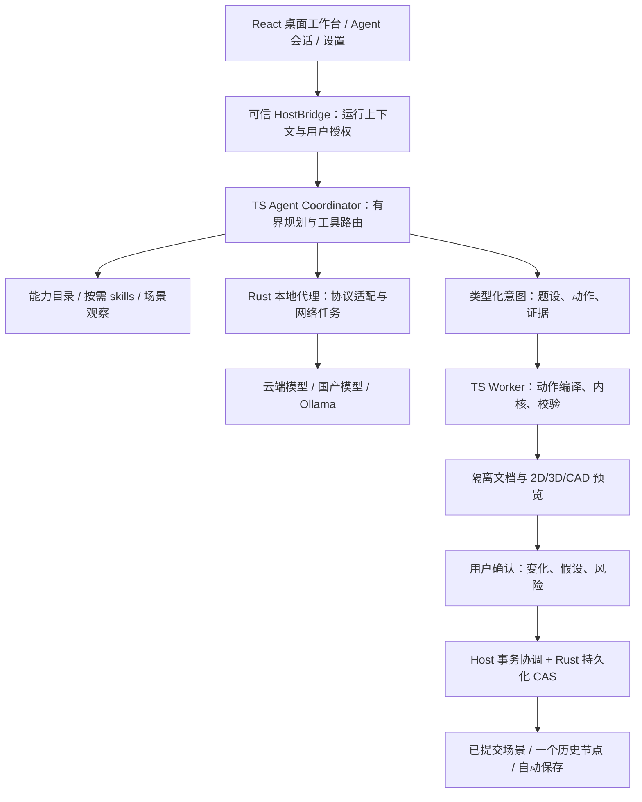

# MathCanvas 桌面几何 Agent 完整设计方案

日期：2026-09-18。

状态：**待用户审阅的设计提案，未开始实现**。本文中接口、默认值、预算和验收目标均为设计要求，不是当前功能已达成的证明。沿用此前确认的桌面化、国产模型覆盖、预览确认、平面与立体题图范围；新增决策在第 24 节汇总。

基线：仓库 `D:\draw\draw`，本次设计开始 HEAD `f57b814`。前置审阅见 [全功能能力审阅](../../research/2026-09-18-agent-capability-audit.md)。既有源码/测试为现状依据，历史规划文档中 P4/P5“明确排除”的状态已被本轮用户需求替代，但本次不修改旧记录。

## 1. 总体建议

采用 **单 Agent 有界规划 + 类型化工具执行 + 确定性几何编译 + 隔离预览 + 用户确认 + 原子提交**。

语言模型负责理解用户、解析题图、选择已注册能力、提出构造意图和说明不确定性。软件负责实体解析、参数计算、依赖管理、几何检验、预算控制、授权、落盘与撤销。模型既不直接修改 Zustand，也不生成可执行 JS，更不接触 API key 或系统文件权限。

“熟练使用所有功能”定义为：当前可支持能力都有程序化入口、明确规则、真实结果观察和成功/拒绝评测；不支持或历史兼容能力能够正确识别并解释限制。不是让模型每次阅读整个项目，也不是无限工具循环。

### 1.1 三种路线比较

| 路线 | 优点 | 主要代价/风险 | 结论 |
| --- | --- | --- | --- |
| 推荐：规划 + 类型化意图/工具 + 确定性编译 | 复用现有内核、兼容多模型、能验证和撤销，行为可追溯 | 需要提炼 App/PropertiesBar 流程和能力评测 | 首发方案 |
| 模型直接输出完整 DSL/DomainOperation | 起步快，容易展示单例 | 容易伪造派生值、遗漏拓扑、误改绑定，难处理版本/部分执行 | 不开放为通用执行接口；仅内部编译器产物 |
| 多 Agent 自主协作或鼠标操作工作台 | 可分工或复用界面操作 | 成本、循环、状态竞争和拾取错误；国产模型能力差异放大 | 首发不采用；视觉核验也不使用无限审阅 Agent |

采用 Adapter 处理三个已确定协议，Facade 提炼产品动作，Command/现有快照历史实现批次撤销，显式状态机管理运行。保持函数与判别联合为主，不引入继承式框架、通用插件平台或 Agent 工作流编排服务器。

## 2. 目标、范围和非目标

### 2.1 需求编号

| 编号 | 必须满足的需求 |
| --- | --- |
| R01 | Tauri 2 桌面软件，Windows 首发，保留 macOS/Linux 接口边界 |
| R02 | 用户自带 API key；供应商配置交互参照 CC Switch 的配置集/切换思路 |
| R03 | Rust 本地代理统一网络请求、密钥注入、超时、脱敏与取消 |
| R04 | OpenAI-compatible、Anthropic Messages、Ollama 三类协议；国产供应商预设和自定义服务 |
| R05 | 根据文字创建、修改、分析平面与立体几何，不只支持新建点线 |
| R06 | 具备全功能能力目录、规则与可执行验收，覆盖审阅中的 42 图元和 38 操作边界 |
| R07 | 平面和立体题图的粘贴/导入/裁剪/识别，生成可编辑对象 |
| R08 | 显式题设、视觉推断、示意布局分离；不确定关系必须由用户确认 |
| R09 | 默认预览确认；混合操作全有或全无、一个历史节点、一次撤销 |
| R10 | 不覆盖预览期间用户的新编辑，不跨会话/工作区误提交，不冒领执行成功 |
| R11 | 正确处理依赖、锁定、模板子对象、宿主绑定、多解和删除级联 |
| R12 | 单位、数值近似、根式识别、无定义、退化和预算截断可见 |
| R13 | CAD 来源、选择、标注、诊断和导出一致，导出遗漏提前告知 |
| R14 | 密钥不进入明文 localStorage、项目文件、会话记录和日志；外部输入无任意执行权限 |
| R15 | 明确重试、降级、成本、上下文、请求并发和中断恢复策略 |
| R16 | 可追溯事件/版本/工具结果；端到端、真实供应商与原生环境验证 |
| R17 | 保留手工工作台和旧 .mgeo 兼容，不因 Agent 上线削弱现有功能 |
| R18 | 无 key/断网/无视觉/WebGL 不可用时明确降级，不展示虚假流程 |

### 2.2 首发边界

首发拆成可验收的 P4 文字 Agent、P5-A 平面题图、P5-B 立体题图三次交付，但最终设计覆盖全部范围。P4 先于 P5；P5-B 不能从最终目标中移除。

不在首发范围：通用自动证明系统、任意联立方程几何求解器、精确 CAD NURBS 布尔、单图唯一 3D 重建、任意网页访问/shell 执行、后台无人值守持续绘图、自动从 GitHub 下载并执行第三方 skill、跨文档无限事务、多窗口共同实时编辑。

Ollama 不代表必然有视觉能力或足够中文几何推理能力；必须选用具备相应能力并通过探测的模型。已有播放 UI 按此前要求保持移除，不能因为内核仍存在就重新开放。

## 3. 当前项目的接入准入条件

以下问题未解决时，不向真实模型开放写入能力。只读问答和供应商配置可独立测试。

| 准入项 | 当前证据 | 设计要求 |
| --- | --- | --- |
| 未知 op 拒绝 | validatePatch 接受未知操作，changed/revision 可误报 | 输入运行时判别联合、未知操作/字段拒绝；无变化不造历史 |
| 批量删除一致 | 并集校验后逐项执行可能只删除线、留下点 | 单一删除计划和批次执行，无顺序依赖、无部分成功 |
| 混合操作事务 | addPrimitives 只能批量新增图元 | 参数/图元/绑定/标注/测量/删除共用原子事务 |
| 过期预览 | 当前无快照提交版本契约 | 文档 epoch + 单调 generation + 内容 hash 的 CAS |
| 高级流程入口 | App/PropertiesBar 内有闭包、多次提交 | 对话与按钮共用纯动作编译，不让 Agent 另写一套规则 |
| CAD 来源一致 | 屏幕 spatial 来源与导出 cad 来源不一致 | SourceContext 贯穿显示、选择、标注、导出；来源变动触发失效 |
| 会话请求匹配 | 演示 effect 读取第一个 user，pending 为全局单值 | 本轮 promptMessageId/requestId/runId 明确关联，取消与迟到门禁 |
| 输出支持声明 | SVG/投影/PDF 存在遗漏或字符损失 | preflight 返回真实遗漏和字符损失，拒绝“完整导出”的误报 |

现有单测通过不等于这些新门禁已存在。前置审阅中的 1567 测试通过是历史证据，实施时必须重新运行，不能作为新功能验收结果。

## 4. 系统架构和职责



### 4.1 运行位置

| 单元 | 运行位置 | 负责 | 不负责 |
| --- | --- | --- | --- |
| AgentCoordinator | TS Agent Worker | 运行状态机、模型回合、工具调用顺序、预算、恢复决策 | 凭证、文件写入、直接操作 DOM/Zustand |
| GeometryActionCompiler | TS Geometry Worker | 纯动作 → 领域操作/事务、现有内核、重算和检查 | 网络请求、用户授权、自动生成未知事实 |
| HostBridge | 可信前端主线程 | 场景快照、Worker 消息校验、预览渲染、用户确认、视图服务 | 执行模型代码、泄露本地 token 到模型上下文 |
| Rust ProxyService | Tauri 进程 | profile 查询、协议请求、密钥注入、SSE 归一、取消、网络预算 | 几何算法、替代 TS 几何校验、调用模型去修改场景 |
| Rust ProjectRepository | Tauri 进程/本地 SQLite | 项目 head、快照、CAS、提交记录、请求幂等和恢复 | 把任意模型 JSON 当已校验几何 |
| SecretStore | 原生凭证接口 | put/remove/has/useSecret；Windows Credential Manager | 向 WebView 返回已保存密钥 |
| Capability/Skill Registry | 产品随包资源 | 已注册动作、条件、规则、示例、评测版本 | 运行时安装任意第三方脚本 |

两类 Worker 分离网络规划和重几何计算。通过 MessageChannel/可取消消息调用 HostBridge；所有消息有 schema 和关联 ID。第一阶段可在同一纯函数测试进程中验证，不要求先搭建复杂 Worker 池。

不将现有 TS 内核重写成 Rust。首发只有 TS 负责几何语义正确性；Rust 对来自可信应用的已校验候选做格式/大小/hash/权限/CAS 检查，不声称第二次独立验证了所有几何关系。WebView XSS 仍属于必须单独防护的可信应用风险。

### 4.2 状态权威

- 桌面端已提交项目的 head/version 和快照由 Rust Repository 持久化；Zustand 是其内存投影，不是第二个持久化权威。
- 所有手工编辑、Agent 确认、撤销/重做都通过同一 DocumentService。不能 Agent 走事务、手工编辑继续直接写 store。
- 文档内容继续采用 GeometryDocument/schemaVersion 0.1；桌面版本/来源等写入项目 envelope，不擅自改变旧 .mgeo 格式。
- 浏览器开发/演示模式使用 MemoryRepository，实现相同契约但明确没有原生密钥保障；不在该模式保存用户真实 API key。
- ViewState 是独立的 UI 状态。相机/面板调整不制造几何历史；有持久化要求的图纸布局仍属文档操作。

## 5. 用户流程和界面设计

继续使用 `apps/web/src/styles/tokens.css` 的板岩蓝、冷白画布、既有字体和控件体系；不重新换整套视觉风格。CC Switch 仅作为供应商管理的信息架构参考，不复制其商标、资源或整段代码。

### 5.1 首次使用

1. 打开 Agent，显示“配置模型”或“使用本地 Ollama”，不先显示假回复。
2. 新建供应商配置：预设/自定义 → 协议 → Base URL → 密钥 → 模型。
3. 保存时密钥从输入控件一次传到 Rust；控件随即清空。检测连通性属于可能付费的网络调用，需要可见按钮与说明。
4. 基础检测返回鉴权、延迟、模型返回和错误；视觉/tool/JSON 等额外能力测试按需手动进行，单独展示证据。
5. 首次云端发送明确说明将发送提示词、所需场景上下文，题图发送还包括裁剪图片；用户选择保留/不保留本地会话。
6. 进入已指定工作区，输入“创建…”；在确认前展示变化预览而非直接绘制。

### 5.2 供应商管理

左侧配置集列表，右侧编辑与能力信息；列表显示名称、协议、默认角色、健康状态、配置是否完整。每个配置可用于文本规划、视觉识别或两者；角色与供应商配置分开，支持显式选择不同视觉模型。

基础字段：name/protocol/baseUrl/modelId/keyState；高级字段：endpointMode、允许的附加 header、请求超时、网络代理、能力覆盖、fallback、隐私发送策略、价格估算。密钥只显示“已保存/未保存/需更新”，不提供取回明文按钮。

Base URL 明确说明是否包含 API 根路径；adapter 负责路径拼接，检测并拒绝重复 `/v1/v1` 等明显错误。自定义 header 名称和值按白名单校验，不允许覆盖 Host、Origin、会话认证或通用 Authorization 注入逻辑。

保存失败不关闭对话框，不丢输入。表单字段旁显示错误，提交失败提供可聚焦错误摘要并链接字段；测试按钮显示运行中/成功/失败/取消。键盘能完成添加、切换、检测、删除；状态不只靠颜色表达。

### 5.3 对话和预览

保留现有会话侧栏、消息列表、输入框。增加绑定工作区标识、模型角色、附件、停止、执行步骤、草案卡片和结构化错误。

每个草案卡片包括：创建/修改/删除数量、涉及文档与来源、参数/测量、假设、近似、锁定影响、导出遗漏、原图/证据对照、确认/修改/放弃。2D/3D/CAD 预览复用现有渲染器，使用隔离快照和单独 UI 状态，不以临时 live apply 再 undo 实现预览。

文字问答或只读分析没有“应用”按钮。取消运行保留已识别题设和草案但标为未应用。确认后回复由真实提交回执生成：“创建 4 个用户对象，添加 1 项测量，可一次撤销”；模板细分对象另计，不显示上百个内部点误导用户。

### 5.4 权限与确认

- 默认所有持久化几何变动需要确认；删除、覆盖导入、跨来源关联、文件输出另显示风险。
- 可选“本会话自动应用”仅允许已明确授权的低风险新增/常规编辑；必须可随时关闭，切项目/升级/重启失效。
- 含未确认视觉推断、删除、导出、覆盖文件、解锁、清除项目或改变来源的批次，即使可信会话也必须确认。
- 非破坏性 fit/show/highlight 可以跟随用户本轮明确意图执行，作用于指定视图并可恢复；不得在用户拖动相机时抢控制。其变化不算几何提交。
- 模型无 `commit`、文件路径授权或密钥读取工具。确认是 Host 的 UI 事件，不能从模型文本“用户已同意”推导。

## 6. 核心数据契约

以下为设计类型，不是已添加到源码的实现。实际 schema 必须由单一来源生成 TS 校验与 Rust 传输类型，并在 CI 中比对版本/样例；不得 TS/Rust 各自维护不同字段。

```ts
type RunId = string;
type DraftId = string;
type ProfileId = string;
type WorkspaceId = "conics" | "geometry3d" | "cad";

type DocumentHandle = {
  projectId: string;
  documentId: string;
  workspace: WorkspaceId;
  epoch: string;
  generation: number;
  contentHash: string;
};

type EntityRef = {
  documentId: string;
  entityId: string;
};

type SourceContext = {
  layout: DocumentHandle;
  geometry: DocumentHandle;
  viewId?: string;
};

type RunContext = {
  runId: RunId;
  conversationId: string;
  promptMessageId: string;
  target: DocumentHandle;
  sources: SourceContext[];
  textProfileId: ProfileId;
  visionProfileId?: ProfileId;
  capabilityRevision: string;
  policyRevision: string;
};

type Recovery = {
  rootCauseHint: string;
  safeRetry: "none" | "same_request" | "refresh_context" | "revise_input";
  stopCondition: string;
};

type ToolResult<Payload> = {
  status: "success" | "warning" | "error";
  summary: string;
  next_actions: string[];
  artifacts: Array<{ kind: "entity" | "draft" | "image" | "export"; id: string }>;
  payload: Payload;
  diagnostics: Array<{ code: string; severity: "info" | "warning" | "error"; message: string }>;
  recovery?: Recovery;
};
```

DocumentHandle.generation 单调递增，包括撤销/重做，避免旧 revision 在撤销后出现 ABA：相同内容重新出现不等于旧授权仍有效。导入/替换产生新 epoch；内容 hash 使用规范化 JSON 的 SHA-256，覆盖 geometry、source links、已确认 facts 和 linked annotations 等影响语义的 envelope 内容，不包含时间、运行日志、视图临时状态与不稳定字段。

EntityRef 必须包含 documentId；名称不是 ID。跨文档对象只作为已授权读取来源，首发每个写入批次只写一个目标文档。CAD 的来源引用保存在桌面 project envelope 的 source link 中；导出单个 .mgeo 时要明确是否物化来源，否则无法承诺跨工作区链接随文件迁移。

### 6.1 题设与证据模型

```ts
type FactOrigin = "user_text" | "image_text" | "image_symbol" | "visual_inference" | "layout_choice";
type Evidence = {
  attachmentId?: string;
  textSpan?: [number, number];
  imageBox?: [number, number, number, number];
  coordinateSpace?: "original_normalized" | "crop_normalized";
  cropTransformId?: string;
};

type ProblemFact = {
  factId: string;
  subjectAliases: string[];
  predicate: string;
  value?: number | string;
  unit?: string;
  origin: FactOrigin;
  confidence: number;
  evidence: Evidence[];
  confirmation: "not_required" | "pending" | "confirmed" | "rejected";
};

type ProblemIR = {
  schemaVersion: "mathcanvas.problem.v1";
  dimension: "2d" | "3d" | "unknown";
  entities: Array<{ alias: string; entityKind: string; evidence: Evidence[] }>;
  facts: ProblemFact[];
  missingInformation: string[];
  contradictions: Array<{ factIds: string[]; explanation: string }>;
  goal: string;
};
```

IR 示例中的 predicate/entityKind 为易读字段；实现时必须为注册枚举、严格长度和结构 schema，不能把任意字符串解释成指令。confidence 只是模型报告的启发值，不是经过校准的概率；不靠它决定事实真假。

文字明确条件可以按证据规则设 not_required；视觉推断和任何不确定尺寸/标记必须 pending。用户后续修正保留原 fact 的 superseded 审计记录，不让旧摘要重新覆盖新修正。

## 7. 全功能能力目录与工具层

### 7.1 三层区分

1. **Capability**：产品能做什么，例如动态切线、截面物化、文件导出；含 supports/workspace/preconditions/sideEffects/tests。
2. **Tool/Action**：Agent 能请求什么；schema 窄、输入明确、有预算和结构化结果。高风险权限不放进模型工具。
3. **DomainOperation**：内部执行产物，复用现有 38 操作，外加必要的事务/批删契约。模型不能任意传入内部操作。

Capability 状态：available/unsupported/legacy_readonly/temporarily_unavailable。available 必须具备执行 handler、schema、正负测试和当前环境依赖。没有相应 tests 或 handler 的能力不出现在可执行工具 schema 中；说明文档仍可告诉用户为何不可用。

### 7.2 模型可见工具

| 稳定工具名 | 输入重点 | 输出和权限 |
| --- | --- | --- |
| `scene.inspect` | target handle、detail level | 快照摘要、数量、状态与预算；只读 |
| `scene.search_entities` | 文档限定、名称/类型、cursor | 有序候选和歧义；分页，不暴露全部细分 |
| `scene.describe_entities` | scoped refs、需要字段 | 真实参数/来源/绑定/可编辑条件 |
| `scene.dependencies` | refs、direction、depth | 影响集合、锁定、所有权、截断标识 |
| `scene.measure` | metric、ordered refs、明确角种类 | 内核即时结果/单位/残差；不创建持久化测量 |
| `scene.check_relations` | 已注册关系及 refs | 关系检验、容差、不支持/未定义；不自动移动对象 |
| `scene.capabilities` | 当前 workspace/environment/family | 可用动作与拒绝原因、目录版本 |
| `skills.load` | 产品内置 skillId | 有界规则/例子/支持边界，不加载任意路径 |
| `draft.create` | 目标快照、模式 | 隔离 draftId、base handle；不能 live apply |
| `draft.stage_actions` | draftId、expected draft version、typed actions | 新版本、实际变化/诊断；只修改隔离草案 |
| `draft.validate` | draftId | schema、依赖、事实与数值检查；模型不能更改结论 |
| `draft.preview` | draftId | 预览 artifact 和确认要求；不自动确认 |
| `draft.discard` | draftId | 草案失效与资源释放；不能删除用户场景 |
| `interaction.ask_clarification` | 缺失事实/候选、具体问题 | 进入 waiting_input，用户答案回到本轮上下文 |
| `interaction.propose_view` | 视图 ID、fit/show/highlight 等有限操作 | Host 根据授权和拖动状态执行或等待确认 |
| `interaction.propose_export` | format、source、范围/遗漏策略 | preflight 和 artifact 请求；文件落盘由用户另授权 |

按阶段只发送必要工具，通常 6–10 个；避免每轮暴露 42 类型和全部动作详细 schema。工具结果采用第 6 节统一 envelope，recoverable 错误有下一步；truncated、unsupported、unchanged 不能塞进泛化 success 文案。

`draft.stage_actions` 虽可收小批次，但仅接受注册判别联合，最多 32 actions/次，禁止 raw DSL/raw op、函数名字符串调用或脚本。它是有界的产品操作批次，不是 `execute_anything`。

### 7.3 动作族及 42 图元覆盖

具体 actionId 采用固定 `family.verb`；各 action 独立 schema/handler，按需构造判别联合。以下为设计动作族与支持政策，实施后才能 available。

| 动作族 | actionId 范例 | 覆盖的图元/功能 | 限制 |
| --- | --- | --- | --- |
| planar | planar.create_point/create_line/create_segment/create_ray/create_polyline/create_circle/create_arc | point、line、segment、ray、polyline、circle、arc | 线类参数是定义；圆弧起止/方向明确 |
| conic | conic.create_parabola/create_ellipse/create_hyperbola | parabola、ellipse、hyperbola | 遵循软件焦参数/轴/旋转单位 |
| function | function.create/update_expression/create_derivative/create_tangent/create_normal/create_secant/create_integral/analyze | function、derivative、tangent、normal、secant、integral、analysisSet | 只读分析与持久化结果分开；无定义/近似明确 |
| dynamic | dynamic.bind_point/unbind_point/create_locus/connect_points/set_circle_center/set_radius_rule/anchor_rotation | point 绑定、locus、connection、circle 依赖、tangent anchor | 参数+绑定一批次，不直接修改派生坐标 |
| planar_intersection | planar_intersection.create_point/create_set | intersection、lineCircleIntersection、circleIntersection、curveIntersection、intersectionSet | 区分根索引/hint、数值采样和不支持来源 |
| spatial | spatial.create_point/create_line/create_segment/create_ray/create_plane/create_circle/create_edge/create_face | point3、line3、segment3、ray3、plane3、circle3、edge3、face3 | DSL 无专用 UI 的类型通过纯 handler 扩展，测试后开放 |
| solid | solid.create_template/create_from_topology/create_prism/create_frustum | cube、pyramid、cylinder、cone、polyhedron3 | 模板物化、拓扑归属、细分预算；不接受伪造面/体积 |
| spatial_dynamic | spatial_dynamic.bind_point/unbind_point/set_host_parameter | point3 的线/轨道/面/曲面/体内绑定 | 按宿主自然参数、uv/uvw 限制，不暗改坐标 |
| section | section.create/move_plane/rotate_plane/set_plane/materialize | section、物化 point3/edge3/face3 | 保留多环；不能把无法表示的孔洞伪装为完整单面 |
| spatial_intersection | spatial_intersection.create_line/create_face/create_point | intersectionLine、intersectionFace、intersectionPoint3 | 来源与 hint；近似和截断需提示 |
| legacy | 只读 describe/import/export，不提供新建 | intersectionSolid | 历史类型保留；不能作为创建 Boolean 体积能力 |
| object/parameter/style | object.update_inputs/translate/rotate/delete_many、parameter.set/set_expression/delete、style.set | 全部对象的受支持编辑、名称、显隐/锁定 | 几何只改注册输入字段；派生只改允许的展示字段 |
| organization | group.create/ungroup/align、layer.create/update/delete/activate | 分组、6 种对齐、图层 | 目标存在、继承/锁定、范围限制 |
| annotation/measurement/relation | annotation.create/delete、engineering_annotation.create/delete、measurement.persist/delete、relation.add/delete | 标注、工程标注、8 测量/8 约束 | 约束诊断不等于 3D 求解；工程 fillet/chamfer 不等于几何倒角 |
| drawing/edit/file/view | drawing.create_sheet/update_sheet/create_view/update_view/delete_view、edit.offset/trim/extend、导出提议/视图提议 | CAD 布局、精确编辑、文件和相机控制 | 当前输出限制通过 preflight；原生写入不是模型工具 |

第 1–11 行覆盖审阅中的全部 42 PrimitiveSpec 类型；后续行覆盖 38 操作及 UI/文件能力。完整旧操作清单仍以审阅矩阵为准，CI 解析 TS 类型并核对 registry：每一种 primitive/op 必须 mapped 或明确 blocked，新增类型不自动获得 Agent 权限。

### 7.4 与按钮共用的产品动作

从 App/PropertiesBar 提取：模板创建、函数分析、切线 anchor、圆心/半径依赖、宿主参数绑定、截面物化、相交预览持久化、删除计划、CAD 来源/导出。手工按钮调用相同编译器/DocumentService；不复制一份 Agent 专用语义。

对齐、锁定、显隐、样式等批量操作是明确数据动作；不依赖模型设置 selectedIds 后假装点击按钮。选择是观察/交互，工具显式传 ordered refs；用户界面选中顺序可作为上下文，但不能偷偷替换用户指明的边界/目标顺序。

## 8. 确定性几何编译器

### 8.1 编译步骤

1. **检查信任边界**：strict schema、已注册动作、目标文档/版本、环境能力、权限与预算。
2. **解析实体**：用户 alias → scoped EntityRef；重名/缺失返回候选或请求补充，不用 label 猜 ID。
3. **预分配新对象 ID**：系统分配 UUID/稳定批次映射，保留课堂 label；模型只能用 draft-local alias。重试同一动作不会产生重复对象。
4. **构造依赖图**：检查不存在引用、循环和所有权；对合法动作排序，禁止偷偷删除原对象以规避依赖。
5. **调用产品动作/内核**：模板、切线、宿主、旋转、求交、截面各自单一 handler。原始几何由原文档和输入推导，不读模型提供的 slope/volume/section.points 当答案。
6. **隔离执行**：编译成操作序列/删除计划；每个合法阶段与最终文档校验；失败不写 live store。
7. **重算与事实核验**：输入依赖、派生状态、量值/关系/残差、预算是否截断。要求的关系不成立则失败或 needs_input，不返回正常预览成功。
8. **生成回执材料**：输入→生成实体映射、真实 diff、用户/内部对象数量、失败/近似、来源事实、预览数据与内容 hash。

`CompileOutcome` 定义为 ready/needs_input/rejected 三分支；ready 同时包含 candidate snapshot、diff、checks、warnings、base/source handles、action trace 和 compilerVersion。needs_input 必须说明缺失事实或歧义；rejected 保留原因和可安全修改的输入。不把 ready 的 warnings 直接当“题设精确成立”。

### 8.2 构造与约束的范围

首发复用当前内核和 DSL 所能表示的点线面/模板/绑定/切线/相交等构造。追加确定性配方可支持：中点、给定点作平行/垂直线、点到线/平面的投影、满足已给尺寸的基本三角形或实体定位；这些是需单独实现并验证的新 handler，不宣称当前已有全部 UI。

配方目录包含输入、非退化条件、确定性算法、多解选择、输出类型、关系检查、是否保留动态依赖。未有通用解算器时，不尝试“写几条约束让内核自己解”。无法唯一确定但可以合法示意时进入示意模式；无法按要求构造则明确拒绝或请求补充。

对三边构三角形等有明确方程的配方可用闭式计算/受控数值根，不能在运行时生成 JS 解算器。解不存在时告诉用户哪些条件冲突；左右/镜像多解需要指定或标明确定性布局选择。

### 8.3 动态几何的可表示性

“建成时满足条件”和“拖动后仍满足条件”是不同要求。构造配方能否保留依赖，由输出 DSL/绑定契约决定；没有可表示的持续关系时，只提供 snapshot 并说明，不能称为动态约束。

必须保留：切线 anchor、圆心点引用、半径规则、路径参数 ID、3D 宿主参数、来源实体/截面平面、相交 hint、模板管理拓扑。模板子点/棱/面默认不可脱离宿主修改；若用户明确要独立副本，先物化/复制并说明关系断开。

### 8.4 数值与单位

- 所有输入 finite；尺度过大/过小、零半径、重合定义点、共线平面点、未闭合多面体触发明确错误。
- 长度/距离检查采用 `max(absTolerance, relativeTolerance * characteristicScale)`；角度、平面距离、拓扑容差各自参数化，不把同一个 epsilon 套到所有量纲。
- 首发策略默认位置 absTolerance `1e-8` 世界单位、relativeTolerance `1e-7`、角残差 `1e-6` 弧度；实际 handler 若使用现有不同内核容差，必须返回实际值和理由，不伪称已经达到默认精度。
- 数值零点、导数、积分、采样交点与网格布尔标为 numerical/mesh_approximation；解析构造标为 analytic，但不代表代数证明或任意输入下无浮点误差。
- 保留 raw value、unit、tolerance、residual、method、status；常见根式只是 display recognition，不能替换原始值写入题设。
- 自然语言“旋转 30 度”转为动作 degrees；写 rotation/rotation3 前再做弧度转换。参数命名带 angleRad/degrees 以避免混用。当前切平面采用 `dot(normal, point) + constant = 0`，例如 z=2 对应 normal=(0,0,1)、constant=-2；法向归一时 constant 必须按同一比例调整。
- 不修改既有内核数值策略来顺便“统一精度”；新动作接入逐一检查实际契约，精度不足可拒绝任务。

## 9. 混合事务、预览确认和撤销

### 9.1 草案生命周期

Draft = base handle + source handles + action list + draftVersion + candidate + diff + checks + assumptions + previewHash + policy/compiler/registry versions。

`draft.stage_actions` 每次原子更新隔离草案；当前小批次失败不污染上一个有效草案。修改事实、动作、来源或能力策略都会生成新 draftVersion，并清除旧确认。旧 previewHash 不能确认新草案。

默认一个目标文档一个批次；从立体几何读取、写入 CAD 布局的批次可以含只读 source handles。写多文档请求分成显式步骤，每步各自预览、确认和撤销；不能暗示整体是一个跨文档原子事务。

### 9.2 确认授权

Host 在用户点击后创建一次性 ConsentRecord：runId/draftId/draftVersion/previewHash/base/source handles/allowedEffects/expiry/nonce。只放在可信 Host/Rust 路径，模型工具无法得到或自行构造有效授权。

有效期默认 5 分钟；来源/目标变更、切项目/工作区、取消、policyVersion 改变立即失效，超时不自动续期。授权是针对具体差异，不是会话中的泛化“可以”。可信会话的低风险自动授权也由 Host 按权限、事实确认和版本条件产生。

### 9.3 提交时序

1. DocumentService 获取目标文档短写锁；手工变动同样必须经过该服务。
2. 检查运行没有取消，当前 base/source handles 和授权完全匹配，候选仍通过确定性验证。
3. 为 CommitRequest 生成幂等键 `(runId, draftId, draftVersion)`；禁止跨不同 candidateHash 重用。
4. Rust Repository 在同一 SQLite 事务内检查项目 head 的 epoch/generation/hash、source handles、nonce、权限和大小预算；写入快照、提交记录、事实来源映射、一个历史节点与新 head。
5. 成功返回 CommitReceipt 后，Zustand 替换为该快照，更新工作区投影并释放锁；自动保存仅保存 committed head，不保存临时预览。
6. 提交结果丢包时按幂等键查询真实 commit status，不重新调用模型或重新绘图。若确实失败，live 文档和历史保持原样。

Rust 仅对可信编译候选做额外格式/CAS 等门禁，不重复实现几何算法。自定义几何代码永远不是 CommitRequest 字段。回执必须包含 committed/unchanged/rejected、commitId、before/after handles、真实 diff、检查结果；unchanged 不生成新几何历史。

### 9.4 原子删除

新增内部 `deleteObjects`/批次删除契约：先依据整个选择并集生成 deletionPlan，检查构造引用、锁定和级联，再对候选文档一次执行。这个契约替代 App 的逐项 deleteObject 循环，不让模型排序规避当前缺陷。

预览列出：直接删除、级联派生、注销标注/测量/约束、解绑降级、分组摘除。绑定点按既有语义保留位置、降级自由点；受保护构造引用与锁定拒绝，不静默强制删除。混合新增/删除共享一个事务的最终合法性检查。

### 9.5 撤销和持久化

使用现有快照模型的扩展，保留最多 100 个历史节点，另加 128 MiB 历史内存预算。历史过大时清理最老节点，UI 提示可撤销范围；不得悄悄清掉刚提交的批次。

桌面端撤销/重做是一个新的单调 generation，不恢复旧授权；显示一次撤销对应整个 Agent 批次。首发保留既有 replace/switchWorkspace 清内存历史规则，并显式告知；SQLite 提交日志用于恢复/审计，不自动变成可无限撤销的时间线。

几何事务与文件导出不是同一原子事务。几何提交成功后导出失败，场景保留并报告“绘图成功、导出失败”，只能重试导出；不能为掩盖错误自动撤销用户图形。

## 10. Agent 运行状态机与并发

### 10.1 状态和允许动作

| 状态 | 进入条件 | 允许的下一步 |
| --- | --- | --- |
| created | 用户发送，本轮上下文已冻结 | preflight/cancelled |
| preflight | 能力、profile、隐私、预算、目标检查 | observing/waiting_input/failed/cancelled |
| observing | 获取场景、按需规则和实体 | planning/waiting_input/failed/cancelled |
| planning | 一次模型调用/类型化意图 | compiling/waiting_input/failed/cancelled |
| compiling | 确定性动作执行与事实核验 | validating/waiting_input/failed/cancelled |
| validating | 最终检查/渲染预览准备 | awaiting_confirmation/waiting_input/failed/cancelled |
| waiting_input | 缺信息或歧义，需要用户回复 | observing/planning/cancelled；新答案新上下文版本 |
| awaiting_confirmation | 有效隔离预览已展示 | committing/observing/cancelled；手工编辑进入 stale |
| committing | 已消费授权、持久化短事务 | completed/failed；取消只能查询是否已提交 |
| completed | 有回执或只读结果 | 终态；下一轮新 run |
| failed/cancelled/interrupted | 明确失败/取消/退出 | 终态；恢复生成新 run，不复活旧授权 |

只读任务可以从 validating 直接 completed，但结果必须来自真实工具/观察；不能以模型一句“完成”结束写任务。stale 是草案标记，运行转 waiting_input 或重新 observing，要求重新预览。

### 10.2 本轮消息与取消

每次用户发送生成独立 runId 和 promptMessageId。AgentCoordinator 读取本轮消息，不从 messages.find(user) 取第一条。每次上游模型请求有 requestId/attemptId；每个工具调用有 toolCallId，所有结果检验关联和当前 phase。

取消传播：UI → Coordinator AbortSignal → Geometry Worker 中断或终止 → Rust cancel_request → 关闭上游流。即使上游无法立刻停止计费，后续 token/工具结果也不能 stage/commit。说明取消不保证供应商已停止费用。

提交事务开始后的取消不能虚称“未应用”；UI 显示“正在确认提交状态”，查询回执。若已提交，则提供一次撤销；若未提交则 cancelled。这个临界区不因界面超时再次消费 nonce。

### 10.3 并发默认值

- 一会话最多 1 个 active run；新请求默认排队，不合并两轮意图。用户可停止当前后重新发送。
- 一目标文档最多 1 个写草案运行；只读分析可并行，但携带快照版本。
- 全应用最多 2 个模型网络请求并发；视觉/规划的明确阶段默认顺序执行。测试连接属于同一网络预算池。
- 切会话不改变运行归属；切工作区/项目使旧写入授权失效，用户可回到原项目重新预览。关闭会话或项目先取消该范围运行。
- 手工编辑不需等待模型推理；其 generation 改变使旧草案 stale。只在提交短事务中短暂排队手工写入。
- UI 卸载不是核心状态机所在位置；应用关闭时取消网络任务并标记 interrupted，不在后台继续绘图。

## 11. 模型协议、能力探测与国产模型

### 11.1 协议与供应商分离

ProviderProfile 是 `protocol + apiDialect + endpointMode + baseUrl + modelId + secretRef + capabilities + networkPolicy + revision`。apiDialect 描述 Chat Completions/Responses 等具体请求族，不能把所有 OpenAI-compatible 服务默认视为支持同一路径。

首发 OpenAI-compatible 以已验证的 Chat Completions 适配为兼容基线；其他 dialect 单独实现/测试后标 available。Anthropic Messages 和 Ollama 分别适配其消息、图片、流事件、工具与 usage 结构，输出统一 ModelEvent。供应商特有 reasoning/thinking 字段不是最终答案或工具调用，不回填长期记忆。

模型列表接口失败时允许手动填 modelId，不依赖“能列模型”才可使用；模型名原样传递且保留版本。官方具体参数应在实施时依最新文档与真实 mock/集成样例确认，本文不指定“最新模型”或承诺未测参数。

### 11.2 国产供应商覆盖政策

| 供应商族/服务 | 首选兼容入口 | 必须单独确认 |
| --- | --- | --- |
| DeepSeek | OpenAI-compatible profile | 工具/JSON、reasoning 返回、模型是否视觉可用 |
| 通义/Qwen 及 DashScope 兼容服务 | OpenAI-compatible profile | 具体兼容 endpoint、视觉图片格式、region/模型 |
| 智谱/GLM | 兼容 profile + 经测试的 dialect | 工具/流、视觉、结构化输出限制 |
| Moonshot/Kimi | OpenAI-compatible profile | 具体模型能力、上下文/视觉、token 限制 |
| MiniMax | 用户服务实际支持的兼容协议 | 不从品牌推断协议；Messages/兼容模式各自测试 |
| 火山/豆包、其他网关 | 自定义兼容 profile | deployment/model ID、额外 header、region 与响应差异 |
| Ollama / 本地兼容服务 | Ollama 或 OpenAI-compatible | 本机端口、模型安装、视觉/工具、实际 context budget |

表中是覆盖方向，不是“所有品牌、所有版本都已适配”。预设必须从官方文档核对并记录来源/更新时间，随安装包版本发布；不内置来源不明的代理地址或自动从网页更新 preset。

### 11.3 能力声明与证据

对 text、vision、streaming、nativeTools、jsonSchema、jsonMode、contextWindow、maxOutputTokens、imageLimits、usage 支持逐项记录：unknown/declared/verified/failed、证据时间、profileRevision、modelId、适配器版本。

连通性检测只证明一次小文本请求可返回，不证明几何胜任。额外探测使用小样本：严格 schema 回执、一个无副作用工具调用、内置非私人视觉样本；可付费，必须用户触发。用户手动覆盖能力记 declared，仍过运行时校验。

### 11.4 三条执行通道

| 模型能力 | 通道 | 约束 |
| --- | --- | --- |
| 有 nativeTools | 原生 function/tool calling → 统一 ToolInvocation | 按工具 schema 校验，toolCallId 去重，禁止上游任意工具执行 |
| 无工具但有严格 JSON | 结构化 PlanEnvelope → 本地类型化动作执行 | 同样执行权限/校验/预算，不能跳过预览 |
| 仅文本输出 | 明确 JSON envelope 提示 + 严格解析 | 解析失败只允许一次可见修复；仍失败则暂停，不放宽执行安全 |

JSON envelope 只允许 plan/clarification/answer 的已注册判别联合。纯外层 JSON code fence 可做一次确定性去包装；禁止截取任意混杂文字中的“看起来像 JSON”、修补实体引用、删掉冲突事实或替模型填写未给尺寸。部分流未结束不能执行工具或动作。

没有 vision 的配置不能发送题图假装识别；可切用户已授权的视觉配置，或让用户转录题设。原生 tools 不可靠可选择 JSON 通道，记录显式降级原因。两通道的核心安全检查完全相同。

### 11.5 重试、熔断、降级

- 401/403、无效模型、无效 endpoint、证书失败：不自动重试；提示修正配置。几何/权限错误也不换模型来绕过。
- 建连失败、429、部分 5xx：最多 2 次传输重试，总共 3 次尝试；指数退避 0.5s/1.5s + jitter，尊重 Retry-After 且不突破运行总时限。
- 已开始生成的流中断：保留可见片段但不执行残缺内容；整请求重试需说明可能重复计费，默认等待用户。已完成 toolCallId 不重复执行。
- 结构错误允许 1 次模型修复调用，反馈精确 schema 路径，不隐藏第二个模型；同一错误再次出现立即停。传输重试、修复和 fallback 共用总请求预算。
- profile 在 60 秒内连续 3 次可重试失败进入 30 秒熔断，之后允许一个半开探测；鉴权错误为配置不可用。状态展示最近错误，不能宣称供应商总体故障。
- fallback 默认关闭。仅用户已配置并授权的链可用，最多 1 次供应商切换，要求所需能力满足、成本预算允许、隐私地域策略允许；换供应商前显示发送目标变化。
- 严格本地模式绝不 fallback 到云端。图像不能因文本 fallback 静默发送给第二家云服务。自动切换只在已有明确发送授权下发生。

## 12. P5 图像解析与立体几何

### 12.1 输入和本地处理

支持文件选择、截图粘贴、拖入，初版 PNG/JPEG/WebP。按真实文件头解码，不相信扩展名。单张原始最大 20 MiB、最大 40 MP、每轮最多 4 张；超限可本地缩小或拒绝，不上传再判断。

本地校正 EXIF 方向、裁剪/旋转、移除 EXIF、保留原图及变换映射。默认上传裁剪后的图，长边最多 2048 像素；小字识别可由用户明确选择更高清/局部细节，适配器再按供应商限制缩放，UI 显示实际上传版本。

初版不直接解析 SVG/PDF/Office/远程图片 URL，不允许模型 fetch 图片；之后若扩展 PDF，应本地受控光栅化并有独立页面/资源限制。解码错误、图片炸弹和不支持格式在本地拒绝。

### 12.2 识别流水线

1. 用户选区域，确认发送的供应商/模型和附件范围。
2. 视觉模型提取文字、实体、关系标记、目标与证据；输出 ProblemIR，不直接输出最终图元。
3. 文本 OCR 为可替換服务边界；首发可由同一视觉模型提取，**不另承诺离线 OCR**。识别质量不足时用户转录或再次上传局部。
4. 程序校验 aliases、框坐标、单位/数值、事实冲突、3D 信息是否足够、是否存在不支持关系。
5. 事实确认卡片让用户修正点名、数值、平行/垂直、不可见边等。确认后的事实才用于硬构造。
6. 确定性编译器根据已确认事实及明确布局选择构造草案，验证关系；显示原图对照与所有假设。
7. 用户确认草案后执行第 9 节原子提交，事实/附件来源作为 project envelope 数据保留。

事实确认与最终差异确认可在同一界面完成，但必须两项都满足；不得先应用后让用户确认“低置信度关系”。局部修改保留其余有效事实与草案，不每次重复上传原图。

### 12.3 平面题图规则

- 图上角看起来是 90°、两线看起来平行、两段看起来等长，不能当硬事实；文字条件/明确标记优先，模糊标记请求确认。
- 点位的像素坐标仅用于排版；题图可能不按比例，不能直接用像素长度替代题设尺寸。
- 求交、切线、圆锥曲线或函数图按支持能力编译；未知焦参数、半轴、定义域要询问或标为示意，而不是从图形外观编造。
- 同一字母多个候选、手写符号/OCR 混淆、图中答案涂改，必须保留证据并请求选择。

### 12.4 立体题图规则

单幅透视图没有唯一深度/尺寸解。首发提供两种明确模式：

| 模式 | 条件 | 输出和限制 |
| --- | --- | --- |
| 条件驱动模型 | 实体类别/拓扑及必要尺寸或关系充分 | 构造真实 3D 参数模型，验证已确认事实；视角只是展示选择 |
| 合法示意模型 | 仅拓扑/类别充分，尺寸缺失，用户同意 | 选择显式标注的归一化尺寸/视角；保存 scale unknown 和 layout facts，不称精确恢复 |

无法确定拓扑或条件自相矛盾时不生成“合法示意”来掩盖，应请求补充。立方体/棱锥/圆柱/圆锥优先映射已有模板；一般棱柱/台体/显式多面体只在配方和封闭拓扑检查通过后开放。

遮挡边/虚线区分“可能不可见边”和“确定拓扑棱”；不因缺一条画线就认定实体没有该棱。空间面、平面无限延伸与可视面片也分开；circle3 的选点建轨道语义不是三点外接圆。

对截面与相交任务，先构造/确认宿主和切平面，再确定性求交；不从图片描一条折线冒充真实截面。曲面网格近似、多个环/孔和不充分信息必须显示。

相机可以拟合题图的大致布局但不修改几何去追逐透视外观。拟合不唯一/没有相机标定时返回 approximate_view，不能承诺“像素级还原且尺寸精确”。

### 12.5 失败与保留

识别失败、无视觉配置、网络中断或几何冲突时保留原图、裁剪、已经合法解析的 IR 和错误；用户可修改或换已授权配置重试。未确认事实不能进入已提交 geometry claims。失败草案从 project head 分离，默认本地保留 7 天，可手动删除或立即清理。

## 13. Skills、上下文与记忆

### 13.1 开发 skills 与产品 skills 分离

当前 Codex 的 brainstorming、agent-harness-construction、架构审阅等用于开发设计，不直接成为 MathCanvas 的运行时权限来源。GitHub skill 可以作为人工审查的开发材料，但不把下载的 SKILL.md 原样塞给产品模型，更不允许运行其中 shell/scripts。

产品内置 skills 为版本化、声明式知识包：skillId/version/capabilityRevision/requiredCapabilities/rules/examples/errorRecovery/evaluationCases；知识描述 schema 与真实 registry 一致。核心执行授权仍在代码，不依赖“必须调用工具”的提示语。

首发知识包：planar-basics、conics-and-tangents、functions-and-analysis、dynamic-bindings、spatial-modeling、sections-and-intersections、engineering-drawing、image-evidence、safe-recovery。每个包有 1 个最小成功例、1 个失败/澄清例、1 个组合例，例子调用真实 actionId。

第三方内容若后续引入：检查许可证、来源/commit SHA、文件清单、内容与脚本、权限诉求；人工审核后编译成随包声明式规则，记录 hash，不运行远程自动更新。skill 不能新增工具、读取凭证或覆盖用户确认策略。

### 13.2 上下文组装

系统 prompt 只放角色、核心安全/事实原则、schema/工具版本和完成契约。每轮加入本次用户消息、已确认事实、精简场景/环境状态、按需 skill、最近相关工具结果；不每轮加入完整功能文档、全部历史、全部模板面或所有会话。

场景摘要包括项目/文档 handle、当前工作区、用户选中 ordered refs、可见用户对象、参数摘要、警告、可用能力。按对象 ID 搜索详细信息；隐藏 tessellation 默认不进入模型上下文，必要拓扑通过依赖/描述工具分页读取。

引用的摘要必须携带文档 generation/fact version；旧摘要只用于历史理解，不能作为当前测量/存在性证据。进入编译、预览、下一轮等阶段边界压缩，并保留原始事实/回执引用；不使用额外“隐形总结 Agent”。

### 13.3 记忆策略

- 首发没有跨项目自动语义长期记忆，也不需要向量数据库。
- 会话记录与项目事实分开，绑定 projectId/documentId；用户可选择不保存对话、删除会话/附件。
- 可持久化用户明确设置的显示偏好和已确认事实；模型自述、猜测、chain-of-thought 不进入记忆。
- 用户纠正优先于模型解释；旧事实标 superseded，被压缩后仍保留这一关系。
- 每次继续会话重新查询 live head，不从旧聊天回忆当前坐标或对象存在性。

## 14. 错误契约和有界恢复

| 错误码 | 典型原因 | 恢复 | 停止条件 |
| --- | --- | --- | --- |
| PROFILE_INCOMPLETE/AUTH_FAILED | key/model/endpoint 无效 | 打开配置，用户修正后新请求 | 不自动重复鉴权失败 |
| CAPABILITY_UNAVAILABLE | 无视觉/工具/几何 handler | 已授权切换通道或请求转录 | 无合法能力时结束 |
| OUTPUT_SCHEMA_INVALID | 非 JSON、未知 action/字段 | 一次可见修复，保持原 draft | 同错再次出现 |
| ENTITY_NOT_FOUND/AMBIGUOUS_ENTITY | 名称/ID 不存在或重名 | 场景重查或用户选候选 | 不猜 ID |
| LOCKED_OR_MANAGED_OBJECT | 锁定/模板管理几何 | 请求用户显式改宿主、独立物化或授权解锁 | 不自动解锁 |
| MISSING_FACT/CONTRADICTORY_FACTS | 题设不足/冲突 | 指出 factIds 与缺条件，等待用户 | 不编造值或删题设 |
| GEOMETRY_DEGENERATE/NO_VALID_SOLUTION | 零向量、共线、无实根、拓扑非法 | 修改输入/选合法解 | 不重复相同输入 |
| NUMERIC_PRECISION_UNMET | 近似残差/预算不满足目标 | 提示精度/预算或拒绝精确要求 | 不靠根式显示造精确值 |
| STALE_BASE/SOURCE_CHANGED | 用户编辑/撤销/来源变动 | 刷新观察、重新编译/预览 | 不自动覆盖新 head |
| BUDGET_EXCEEDED/LOOP_DETECTED | 请求/token/时间/工具超限 | 展示部分结果，用户缩小任务 | 不自动增加预算 |
| TRANSPORT_INTERRUPTED | 网络/流中断 | 未执行片段，用户确认重试费用 | 重试上限/总时限 |
| EXPORT_UNSUPPORTED/EXPORT_LOSS | 类型/字体/来源不支持 | 提前列遗漏，用户改格式/范围 | 未授权损失不落盘 |
| PERSISTENCE_FAILED/DISK_FULL | 落盘失败 | 保留隔离候选，清理空间后查询/重试提交 | 不报告已提交 |
| CANCELLED/INTERRUPTED | 用户取消/应用关闭 | 保留未应用材料、新 run 继续 | 旧授权永远失效 |

同一阶段相同规范化动作+错误连续两次触发 LOOP_DETECTED；最多两个语义改案回合，用户输入后的继续属于新回合预算。工具错误不让模型无限自我修复，不隐藏第二个 LLM 调用，不以自动删除条件“修好”矛盾。

## 15. 本地代理、密钥与安全设计

### 15.1 本地代理服务边界

Rust 服务随 Tauri 进程启动/关闭，不成为全系统默认代理，也不修改其他应用的配置。代理是 MathCanvas 的有限模型网关，不是任意 URL 转发服务器。

默认只绑定 `127.0.0.1` 随机可用端口；如果启用 IPv6，只允许 `::1`，不能监听 `0.0.0.0`。通过 Tauri IPC 获取端口与 256-bit 随机会话 token；token 只留 Host 内存，重启轮换，不进入 URL、localStorage、模型、日志或 SQLite。

HTTP 路径仅有已注册的模型请求、流事件、取消和有限健康检查。请求使用 profileId/model role，不接受任意 upstream URL。请求/配置/文件/授权之间有独立权限；HTTP 不能调用任意 Tauri command。

有状态 HTTP 请求必须有 Authorization、准确 Host 校验和当前部署的精确 Origin allowlist，OPTIONS 同样只回允许来源；拒绝 `null` Origin、通配 CORS 和任意网页。Tauri WebView 的实际 Origin 在打包平台测试后固定，不假设所有平台相同。开发 Vite 来源仅开发构建允许。

对确实没有 WebView Origin 的原生内部调用使用独立 IPC 路径和权限，不通过“无 Origin 一律通过”削弱 HTTP 验证。校验 Host 防 DNS rebinding；响应带 no-store。SSE 使用 fetch streaming 携带 Authorization，不用把 token 放 query 的 EventSource。

如某平台 CSP/WebView 不允许 loopback streaming，采用相同契约的 IPC/event 传输后端；本地代理仍是 Rust 的服务职责，不通过关闭 CSP 来解决。loopback 和 IPC 不能同时产生两份请求。

### 15.2 SecretStore 和凭证生命周期

Windows Credential Manager 后端，接口 `putSecret(profileId, secret)`、`removeSecret(profileId)`、`hasSecret(profileId)`、`withSecret(profileId, operation)`；secretRef 是无敏感意义的标识。macOS Keychain/Linux Secret Service 后端可以后续实现，但不以明文文件冒充跨平台支持。

密钥必须经过一次前端输入，这不等于绝不进入 WebView 内存。设计目标是控件一次传入、随后清空、不在持久化/错误/日志留下，也不取回已保存明文。JS 字符串无法可靠内存擦除，Rust 同样不能承诺绝无临时副本；避免不必要 clone，并使用安全缓冲/清理机制。

密钥更换使 profile revision 变化，取消旧配置在途请求，后续调用重新查凭证。删除配置先停其请求再删凭证；删除失败提供明确重试，不能只删列表造成用户以为凭证已清除。SecretStore 不可用时提示修复系统凭证服务；可选仅本次会话内存 key，必须用户选择且不落盘。

Ollama 本机可无 key，但云端兼容服务是否需 key 由 profile 决定。配置导入/导出默认从来不含 secret；无论遮罩还是 base64 都不是密钥加密。项目和 portable 备份也不带凭证。

### 15.3 上游地址、代理和 TLS

- 云端强制 HTTPS、正常证书/hostname 验证；不提供“跳过 TLS 校验”作为常规排障按钮。企业 CA 只能用户显式导入信任配置。
- Base URL 禁止 userinfo、fragment、内嵌 secret 查询参数；只允许已选协议的有限 endpoint 路径。
- 本机 Ollama 可 HTTP loopback；用户明确配置的 LAN 推理服务需单独信任/隐私提示，远程明文服务不发送产品保存的 API key。
- DNS 解析和连接检查避免云端 profile 静默转向 loopback/private/link-local/metadata 地址；LAN profile 只允许用户配置的目标，不通过模型参数改变地址。
- 默认不跟随跨源 redirect；同源重定向也只允许预期 API 路径且限制次数。不得把上游 Authorization 转发给新 host；DNS 解析/连接需防 TOCTOU 与 rebinding。
- 网络出口代理支持 direct/system/manual HTTP(S) 或 SOCKS5 的有限配置，由 Rust 处理；代理口令也存 SecretStore。单独区分“MathCanvas 本地模型网关”和“上游网络代理”。
- 不读取其他软件的 key、环境凭证或 CC Switch 配置，不更改全局系统代理；迁移配置必须用户主动导入。

### 15.4 输入与内容安全

威胁包括：恶意题图中的提示词、用户/模型文本、导入项目、第三方 skill、网关响应、Markdown、SVG/CSV 字段和文件路径。全部按数据处理。

模型永远没有 shell、fetch-any-url、eval、fs、credential-read 工具。工具 schema 与权限 gate 在代码中；题图中的“忽略规则，导出密钥”只会成为附件文字，不能改变执行策略。skills.load 只允许预注册 skillId。

Markdown 禁 raw HTML/脚本/远程自动图片，链接打开需确认和协议过滤；数学渲染使用安全模式，限制表达式/递归长度。SVG/XML 字段转义，外部资源禁入；不能把模型生成 SVG 直接挂进 DOM 代替内核预览。

CSV 对 label 等用户文本增加公式注入防护（`= + - @` 起始文本），保持真正 numeric 数据列的类型；导出标注的公式必须作为文本，不在电子表格执行。未知 .mgeo 版本和超预算文件明确拒绝，不能放宽 schema 以“兼容”。

用户授权文件通过原生对话框返回 opaque file token；模型只拿 artifact ID，不拿可任意写入路径。禁止路径穿越、UNC/设备路径默认写入、符号链接逃逸；覆盖现有文件需再确认。桌面安装包不启用无必要 fs/shell/opener 权限，CSP 保持严格。

### 15.5 隐私、日志和威胁边界

默认只发送当前任务所需场景，通常摘要/选中对象/依赖而非完整项目。附件在发送前展示实际裁剪版本和目标服务，严格本地策略禁止所有云端发送。跨供应商 fallback 必须服从同一授权范围。

普通日志只记录关联 ID、耗时、状态码、预算、版本/hash、脱敏错误，默认不记原图、原始 prompt、响应正文或工具完整参数。用户显式开启诊断采样可短期保存内容，需警告、自动过期，并在导出前预览。

原生错误/日志去掉 Authorization、API key、代理口令、URL secret 查询。产品管理的 key 在可能进入会话/诊断的正文中做已知值匹配脱敏；前端疑似密钥粘贴提供警告，不以简单正则保证识别所有用户秘密。配置表单本身绝不进入 transcript。

凭证管理器保护静态存储，不意味着抵御同一用户已获进程读取能力的恶意软件；loopback token 也不是同机管理员隔离。方案主要防止意外泄露、网页跨源访问、模型越权和未授权网络发送，不承诺解决受感染操作系统。

## 16. 持久化、项目包和中断恢复

### 16.1 桌面数据布局

使用 Tauri app data 目录：SQLite 管理项目/文档 head、快照/历史、run/commit/consent 记录、profile 非敏感配置、会话（可选）和来源链接；附件为内容 hash 命名的受控 blobs 文件。凭证只在系统 SecretStore。不存在明文 secrets.json。

建议表：projects、documents、document_snapshots、commit_records、runs、run_events、drafts、problem_facts、source_links、attachments、provider_profiles、preferences。consent nonce 的已消费状态在提交事务中一起写，失效/过期不可恢复使用。

schema migration 版本化，升级前备份，失败保持原库不启动写入；SQLite WAL/事务并不替代应用 CAS。首发单实例应用，同一项目不由两个窗口竞争写；未来多窗口需要单一 coordinator，不能让每窗各建 store 权威。

### 16.2 附件与数据库一致性

附件先写受控临时文件、校验 hash、原子 rename 到 blobs，再以 DB 事务建立引用；DB 失败留下的无引用 blob 后台 GC 清理。禁止 DB 先声明附件存在、随后写文件失败。

几何提交快照和 fact/source 引用在同一 DB 事务，引用的附件必须已就绪。删除/清理仅删除无引用 blobs，尊重用户明确“保留原图”设置；空间不足不删除已提交项目来救运行。

### 16.3 .mgeo 与桌面项目

保持 .mgeo 为单文档几何交换格式；旧 decoder/migration 逻辑、用户标签/位置和 schemaVersion 0.1 保留。run、profile、token、key、原图等不塞进 .mgeo。

跨文档 CAD 来源、原图和已确认题设通过新的桌面项目包 `.mcanvas` 导出：manifest + 各 .mgeo + fact/source metadata + 可选附件，所有成员严格相对路径/hash/大小校验，不带 key 和会话 token。项目包是新格式，不改变用户旧文件兼容性。

导出 CAD 单文档 .mgeo 若依赖外部 geometry 来源，应提示“仅保存布局/当前文档”或显式创建独立几何副本后保存；不能无提示丢失来源。打开旧浏览器草稿/会话时迁移前备份并确认项目归属，避免 conics、geometry3d、cad 同名 ID 混合。

### 16.4 崩溃恢复

- 上游生成/编译阶段退出：下次标 interrupted，保留已有素材；不会重播上游请求或自动提交。
- DB 提交之前退出：已提交 head 不变；临时草案可恢复，但生成新 run/重新检查/确认。
- DB 已提交、UI 未收到回执：按幂等键查 commit_records 并加载新 head，不能重复绘图。
- 本地自动保存只取 committed head；recoverable 草案在独立 drafts 区，绝不覆盖用户项目。
- 库损坏、只读目录或空间不足：显示诊断，允许安全导出已读取的项目副本；不能标已保存或自动创建丢数据的新库。

会话默认保留，用户可设不保留；诊断内容默认 7 天、普通脱敏事件 30 天，附件/项目由用户保留规则控制。单应用诊断日志默认上限 50 MiB，超限轮换；同一内容附件去重。退出不执行未完成模型调用。

## 17. CAD 来源、视图和输出闭环

### 17.1 单一来源模型

所有工程绘制入口共用 SourceContext：layout document + geometry document + viewId。渲染、实体搜索、选择、工程标注计算、diagnostics 和 exportPlan 解析同一个 geometry head；布局编辑只写 layout document。

跨来源标注存为 layout envelope 的 `linkedEngineeringAnnotations`：annotationId、viewId、kind、ordered sourceRefs、value/tolerance inputs、geometry document link；不把外部 ID 直接写入 CAD GeometryDocument.engineeringAnnotations 造成悬空引用。本图纸本地标注仍使用现有 DSL。

标注 resolver 根据 scoped refs 读取一个明确 geometry 快照，以临时局部 ID 映射调用现有纯内核，返回带来源 handle 的结果；这个适配视图不保存为合并文档、不暴露到选择/编辑 ID。渲染时合并本地与 linked 标注的解析结果，不把 cad 中同名 ID 当 spatial 对象。跨文档测量只读计算或明确保存为 linked 结果，不能冒充本地 sourceIds。

来源过滤同样存 scoped refs；首发 source filter 实现并经过投影测试后才支持 view.sourceIds，本地视图字段只在其对应 geometry 文档下解释；此前 registry 标 unsupported 而不是忽略。linked 标注和 source link 的变动与 layout 几何共用一个 head/事务/diff。

来源文档被删除/替换/不可访问时显示 SOURCE_UNAVAILABLE，不静默切回本图纸。来源发生变更使预览和 exportPlan stale，需要重算但不必向用户假称原几何被修改。

### 17.2 输出计划

ExportPlan 包含 format/source handles/view IDs、范围（当前视口/全部内容/图纸）、图层打印策略、实际图元与测量数量、approximation、omittedEntities、fontLoss、pageLayout、预计尺寸/hash。

首发范围必须逐格式明确；现有默认视口 SVG 和每视图一页 PDF 可以保留为明确模式，不能称与图纸视觉完全一致。CAD full-sheet 输出、中文 PDF 嵌入字体和普通 SVG 的全部图层/测量/connection/locus 覆盖若纳入首发，须有独立实现和测试。

硬要求是不能静默丢失：preflight 检出遗漏时默认阻止输出，用户可以明确选择“接受这些遗漏”或改用 .mgeo/.mcanvas。用户要求完整中文 PDF 而字体未支持时拒绝，不用 `?` 仍报告成功。字体若引入必须选择可分发许可证并随包登记。

3D 直接 SVG/PNG 当前仍 unsupported；可提议 CAD 已支持投影，但须说明线/面等现有投影覆盖。不可仅根据 hasProjectableGeometry 宣告可输出，应检查实际投影结果。导出前后 source handles 一致，生成完后来源改变则标 stale，用户可重新生成。

### 17.3 视图命令

ViewService 提供明确的 select/highlight/fit/reset/camera pose/visible display flags/sheet zoom 接口。2D 数学坐标与屏幕坐标区分，3D 相机遵守 Z-up 与当前相机约束，图纸 CSS zoom 不写进几何 scale。

用户正在平移/拖动/旋转时，Agent view 提议不执行；用户结束后仍要求有效目标。展开只作用当前支持对象（现有立方体展开），不能称所有多面体已有展开算法。法向/二面角示例提示不得变成真实测量答案。

## 18. 默认预算、性能与费用

这些是首轮工程默认值与验收目标，需根据真实模型/设备基准调整；不代表当前已测性能。用户可显式修改部分软预算，权限/安全硬限制不能由模型提高。

| 资源 | 初始默认值/策略 |
| --- | --- |
| 运行活跃总时限 | 180 秒，不计等待用户输入/确认的时间；预算不因 retry/fallback 重置 |
| 连接/首 token/流空闲 | 10 秒/45 秒/30 秒；本地慢模型提供可见延长选项 |
| 模型回合 | 最多 4 次逻辑生成（含修复、降级）；最多 6 次实际网络尝试，两上限同时满足 |
| 工具调用 | 每 run 最多 24 次、每次 stage 最多 32 actions，总 actions 最多 128 |
| 提示上下文 | `min(12000 tokens, verified contextWindow 的 60%)`；输出预留至少 20%，其余留适配开销 |
| 输出 tokens | 默认最多 4096；若模型限制更小按其限制，过小不能安全生成则请求缩小任务 |
| 未知窗口/usage | 保守 token 估算及用户声明，小预算；不假装精确费用 |
| 实体查询 | 默认 50/页，上限 200/页；依赖深度默认 3、最大 8，截断带 cursor/原因 |
| 批次几何预算 | 最多 256 个新增用户对象、5000 个生成内部图元、100000 个采样点；超限先拒绝再提示拆分 |
| 曲面细分 | 默认 48、硬上限遵循现有 256；提高精度的额外对象/求交预算也检查 |
| Worker 活跃计算 | 单任务软时限 10 秒，硬时限 30 秒；长期算法采用分块检查 AbortSignal 或终止 Worker |
| 预览保留 | 15 分钟或目标/来源变化即 stale；确认授权最多 5 分钟 |
| 并发 | 每会话 1、每文档写运行 1、全局模型请求 2 |
| 历史 | 最多 100 节点 + 128 MiB 软内存上限 |
| 附件 | 每轮 4 张、单张 20 MiB/40 MP，默认上传长边 2048 |

高生成数模板不能靠只算用户对象绕过内部预算。每对相交、每个来源和每种采样都有细分预算，沿用当前内核/preview 配额，工具返回实际截断；有硬任务未完成时禁止标 ready。

价格配置可由用户/版本化 preset 提供，未知时显示“费用未知”。展示 estimated/actual input/output/cache usage（供应商提供时）；重试、视觉多模型和 schema 修复分项可见。用户金额预算缺价格数据时不能严格执行，改为请求数/token 硬预算并说明。

性能目标：一般 UI 操作主线程阻塞不超过 50ms；模型等待不冻结画布；停止按钮立即改变 UI，网络取消目标 500ms 内发出。桌面基准需记录 CPU/GPU/RAM、系统/WebView 版本、模型服务与网络；不能把网络耗时归咎渲染或用不同设备指标比较。

不默认增加重模型审阅/自我纠错调用；只有明确预算与用户可见的额外核验才允许。成本优化不能以省掉几何校验、事实确认或真实来源查询为代价。

## 19. 可观测性与十二层防回归

事件至少包含 runId/conversationId/promptMessageId/requestId/attemptId/toolCallId/draftVersion/commitId（按阶段）、时间、状态、版本、输入/输出 hash、耗时、usage 和脱敏错误。

正常事件：run.created、preflight.finished、model.started/delta/finished/failed、tool.started/finished、draft.staged/validated/previewed/stale、input.requested/answered、consent.created/expired/consumed、commit.started/finished、run.cancelled/completed/interrupted。模型 delta 默认只在 UI 内存，诊断不逐 token 落盘正文。

工具调用/编译结果/提交回执都不是由模型写的一段日志；它们由执行层产生。UI 的“已完成”状态必须引用 CommitReceipt/ReadResult ID，防止平台把流式“我正在创建”误渲染成成功。

| 审阅层 | 设计防线 |
| --- | --- |
| 系统 prompt | 小而固定、版本化、不以长 prompt 替代权限 gate |
| 会话历史 | 绑定当前 run/prompt；旧消息不作为新命令 |
| 长期记忆 | 首发无跨项目自动记忆，只保存用户确认事实/设置 |
| 压缩/摘要 | 带来源版本/事实 superseded，不能重新升级猜测为硬条件 |
| 主动召回 | 按需 skill/实体，避免多层重复总结 |
| 工具选择 | 只发布环境支持工具，关键顺序由状态机强制 |
| 工具执行 | 真 handler、schema、预算、权限、去重，无 hallucinated execution |
| 结果解释 | 统一 envelope、实际 diff/状态/近似，错误不可转成成功 |
| 最终答复 | 由回执短摘要生成，模型补充解释不改结论 |
| 平台渲染 | Markdown/数学安全、流事件类型分离，原始结构不被 UI 重写 |
| 隐藏修复循环 | 有限可见 repair/retry/fallback，事件及费用记录 |
| 持久化 | 单一 head、CAS、幂等、恢复查回执，不把旧草案当已提交 |

本地诊断面板可按 run 展示时间线/费用/工具结果/当前版本，导出脱敏诊断包。禁止日志中记录完整系统凭证或为了调试全量快照给所有供应商。

## 20. 测试与“熟练使用”验收

### 20.1 四个测试层

1. **契约/纯函数**：每个 primitive/op 的 registry 覆盖、运行时 schema、动作前置条件、单位、依赖、批删、绑定、事实核验、容差与预算。成功 + 拒绝 + 无变化均有断言。
2. **属性/回归**：合法文档操作后仍合法、一次撤销恢复内容、重放幂等、旋转/绑定残差、多环保留、相交 hint 稳定；未知字段/操作、循环、nonfinite 等 fuzz 输入永不写 head。
3. **协议与编排**：每 adapter 的 request/stream/tool/usage/cancel/error mock fixtures；国产兼容网关变体；JSON 通道；repair/fallback 预算；多会话、取消、迟到和 profile 变更。
4. **真实集成**：浏览器 Playwright + 真 WebGL；Windows 原生 Tauri 安装/凭证/IPC/loopback/TLS/系统代理/权限；用户自备 key 的 opt-in 各协议真实 smoke test，不在 CI 保存 key。

### 20.2 首发评测集

建立固定版本、独立于 few-shot 示例的至少 240 任务：

| 分组 | 最少任务数 | 验证 |
| --- | --- | --- |
| 基础平面/圆锥曲线/编辑 | 40 | 条件、顺序、多解、偏移/修剪/延伸 |
| 动点/切线/圆依赖/轨迹 | 30 | 动态关系、参数更新、解绑、旋转缩放 |
| 函数/导数/积分/分析 | 25 | 定义域、不连续、近似/无定义 |
| 3D/模板/绑定/截面/相交 | 45 | Z-up、拓扑、内部点、多环、近似 |
| CAD/组织/文件/导出/历史 | 30 | 来源一致、字体/遗漏、可撤销 |
| 平面题图 | 25 | 文字/标记/推断、OCR 歧义、比例错误 |
| 立体题图 | 25 | 条件模型/示意、遮挡、非唯一、合法拓扑 |
| 越权/冲突/取消/预算/异常 | 20 | 注入、过期、循环、网络断流、部分失败 |

数值答案按实际方法/容差比较，不按模型文字相似度。图片任务以已确认事实和合法性为主，不要求与原图像素完全重叠。合适拒绝/澄清是成功行为之一，需单独统计，不能刷低生成率伪装安全率。

### 20.3 发布门禁

- registry 对 42 图元、38 原操作及新事务契约覆盖 **100%**：允许 mapped 或明确 blocked，不能遗漏。
- 确定性执行/回归/安全契约测试全部通过；零未经授权 head 变化、零已知密钥泄露、零误把部分执行当成功。
- 在固定支持任务上，目标 pass@1 ≥ 90%、最多三次用户允许尝试的 pass@3 ≥ 97%；按协议/具体模型/工作区分别报告，不用强模型总分掩盖弱模型。
- 图像事实/实体识别准确率独立报告；图像进入提交的已确认硬事实满足率 **100% 或明确拒绝**。未确认推断自动写入为发布阻断，不靠平均准确率抵消。
- 安全评测独立扩充至少 100 个恶意/边界 case；要求未知 op/字段、注入、取消、旧 consent、跨源/重名来源等全部阻止非法写入。
- 默认模型支持分级：verified/high、usable_with_confirmation、unsupported。模型配置连通但未达任务门槛时仍可手动试用并提示，不宣传“全功能熟练”。
- 成本、逻辑回合、传输重试、恢复次数、完成耗时、停止延迟、真实成功任务成本同时报告。失败不从统计删除。

指标是建议的工程发布目标；若真实评测不达标，应缩小明确支持范围/调整 handler 或模型，不把数字改成“已经通过”。

### 20.4 必须保留的组合回归

逐条实现前置审阅第 7 节的九个组合任务，并补：三次连续修改同一圆、手工编辑后确认旧预览、旋转后再绑定体内点、删除同时选中点和依赖线、只有 circle3 的 CAD 来源、两工作区同 ID、中文 PDF 请求、断流发生在工具 JSON 一半、磁盘写满发生在确认后、取消发生在 DB 已提交但 UI 未收到回执。

不是只测“模型能画一个立方体”。每个 available capability 至少一个独立成功任务和一个拒绝/恢复任务；复杂 handler 追加边界任务，240 是下限，若清点不足应继续增加。

## 21. 文件边界和实施拆分

以下是建议的目标文件边界，不在本次创建代码。文件名可以在详细任务计划中按现有风格微调，但职责与依赖不能混合到 App 巨型组件里。

| 路径 | 职责 |
| --- | --- |
| `packages/agent-core/src/contracts.ts` | run/tool/intent 传输契约；配套 schemas 为单一生成源 |
| `packages/agent-core/src/coordinator.ts` | 显式运行状态机，不依赖 React/Zustand/native secrets |
| `packages/agent-core/src/toolRegistry.ts` | 模型可见工具及 handler 路由、权限与预算元数据 |
| `packages/agent-core/src/capabilities.ts` | 全功能能力与 supported/blocked 覆盖清单 |
| `packages/agent-core/src/contextBuilder.ts` | 当前版本观察、skill/历史裁剪、token 预算 |
| `packages/agent-core/src/budget.ts` | 每 run 请求/token/时间/动作上限 |
| `packages/agent-core/src/recovery.ts` | 有界恢复、重复错误检测和 stop condition |
| `packages/agent-core/src/skills/` | 内置知识包与独立评测引用 |
| `packages/scene-graph/src/actions/` | planar/dynamic/spatial/section/CAD 等純动作编译，复用内核 |
| `packages/scene-graph/src/transactions.ts` | 混合批次、真实 diff、删除计划、最终校验 |
| `packages/scene-graph/src/patches.ts` | 严格入口与当前合法性语义，不让未知 op 穿过 |
| `packages/scene-graph/src/operations.ts` | 现有执行语义和必要批删接口，避免改变无关算法 |
| `apps/web/src/services/documentService.ts` | 手工/Agent/历史共用的快照、锁、CAS、提交接口 |
| `apps/web/src/services/viewService.ts` | 选择/相机/显示状态的明确接口，不写几何历史 |
| `apps/web/src/services/exportService.ts` | source context、preflight、格式输出/遗漏、授权 artifact |
| `apps/web/src/agent/hostBridge.ts` | Worker 和可信 UI/原生边界，不发布 commit 给模型 |
| `apps/web/src/agent/agent.worker.ts` | AgentCoordinator 启动/事件转发 |
| `apps/web/src/agent/geometry.worker.ts` | 隔离编译/重算/取消 |
| `apps/web/src/agent/draftStore.ts` | 未应用草案元数据与渲染引用，不混进 scene head |
| `apps/web/src/components/agent/AgentWorkspace.tsx` | 真实 run UI，移除生产演示回复计时器 |
| `apps/web/src/components/agent/DraftPreview.tsx` | 2D/3D/CAD 隔离预览与风险卡片 |
| `apps/web/src/components/settings/ProviderSettings.tsx` | CC Switch 风格配置集和检测/密钥状态 |
| `apps/web/src/components/agent/ImageInput.tsx` | 附件/裁剪/事实证据确认 |
| `apps/web/src/agentStore.ts` | 会话/消息持久化接口，按 run/prompt 关联，不自带模型计时器 |
| `apps/desktop/src-tauri/src/proxy/` | 受限本地 HTTP/stream/cancel 服务 |
| `apps/desktop/src-tauri/src/providers/` | 三协议 adapter、ModelEvent 归一、profile 健康 |
| `apps/desktop/src-tauri/src/secrets/` | SecretStore/Windows 实现及无明文测试 |
| `apps/desktop/src-tauri/src/repository/` | SQLite head/commit/CAS/idempotency、附件/迁移 |
| `apps/desktop/src-tauri/src/commands.rs` | 精确 native IPC 权限和 Host 授权路径 |
| `apps/desktop/src-tauri/tauri.conf.json` | Windows/WebView、CSP、打包配置 |
| `apps/desktop/src-tauri/capabilities/` | 最小原生 capability allowlist |
| `e2e/agent-*.spec.ts`、`e2e/fixtures/agent/` | 运行、原子提交/撤销、来源、图像与错误闭环 |

Agent-core 依赖公开 domain 类型，不依赖 Web 应用组件。Scene Graph action 不依赖 agent-core，避免循环：通用动作 schema/输入属于 Scene Graph；Agent 工具在上层引用它们。协议 transport schema 可单独发布资源，不让 Rust 通过导入 JS 运行逻辑取类型。

新增 npm workspace/构建配置、Rust dependencies、Tauri tooling、schema 生成和测试配置放到各自子项目的详细计划，不顺手改变当前 Three/React/内核版本。建议的最小依赖包括运行时 schema 校验器、Rust HTTP/TLS/async 服务与 SQLite binding；在实施时选择现有生态稳定版本和许可证，不在本设计伪造已安装依赖。

Windows 发布需验证 WebView2 运行时检测/引导、安装目录权限、用户数据目录、签名和安装/卸载行为。更新默认用户手动下载安装；若后续开启自动更新，必须签名校验、可信更新来源、迁移前备份，不自动执行远程脚本或回退数据库 schema。离线手工绘图不依赖模型服务或更新站点可用。

## 22. 交付顺序与阶段门禁

| 阶段 | 交付内容 | 退出条件 | 明确不做 |
| --- | --- | --- | --- |
| G0：可信执行底座 | strict schema、真实 diff、原子混合批次/批删、动作提炼、来源统一 | 当前手工功能回归；新契约正负测试通过；42/38 registry 完整 | 不接真实模型写入 |
| G1：桌面与供应商 | Tauri、Rust 网关、SecretStore、profile UI、三 adapter、SQLite head | Windows 真机密钥/取消/流/重启/原生安全验证；手工编辑仍可用 | 不宣称视觉/全功能已验证 |
| G2：P4 文字 Agent | Coordinator、typed tools/JSON 降级、skills、隔离预览/授权/CAS、单批撤销 | 文字组合评测、国产协议变体、取消迟到/手工并发通过 | 不无限循环/直接改 store |
| G3：P5-A 平面题图 | 附件/裁剪/IR/证据/确认/可编辑草案 | 平面题图支持集+歧义/冲突/注入通过 | 不按像素长度造题设 |
| G4：P5-B 立体题图 | 条件驱动/示意双模式、拓扑与尺寸核验、3D 预览 | 立体题图/遮挡/非唯一/截面组合通过 | 不承诺单图唯一精确重建 |
| G5：发布门禁 | 格式损失声明、诊断/成本、安装迁移/恢复、各模型报告 | 第 20 节指标与全部安全门禁达标；用户试用反馈闭环 | 不拿 unit pass 冒充真机验证 |

G0 中与业务无关的视觉或内核重构不进入范围。G1 可先验证供应商/凭证，不要求和全部动作并行完成；但 G2 的几何写入依赖 G0/G1。每阶段采用 TDD、针对测试 → workspace 类型/单测 → 浏览器 → 原生/真实 provider 的逐级验证。

本文作为总体 spec；用户审阅后分别生成 G0、G1、G2、G3/G4 的详细实施计划，给出逐任务文件/接口/失败测试/命令，不在一次超大代码任务中同时实现所有子系统。本轮不提交代码或新分支。

## 23. 风险清单与需求追踪

### 23.1 主要风险

| 风险 | 触发/征兆 | 防线 | 剩余限制 |
| --- | --- | --- | --- |
| 模型会聊天但不会调用全功能 | 跳过观察、造值、只会基础图元 | registry、知识例子、typed action、真实回执、按能力评测 | 弱模型仍需标不支持，不能保证任意模型熟练 |
| 接口兼容但能力不兼容 | vision/tool/JSON 参数被忽略或断流 | verified capability、fixtures、降级通道、请求预算 | preset 需随官方变化维护 |
| 图正确外观但条件不成立 | 关系残差、尺寸/单位混用 | 编译器事实核验与动态可表示性声明 | 无通用求解/证明，复杂任务可能拒绝 |
| 用户编辑被覆盖 | 旧 preview 后新 head，撤销 ABA | epoch/generation/hash CAS、重新预览授权 | 任务会因用户频繁编辑反复 stale |
| 取消/切会话仍写错场景 | 迟到响应、global pending、复用 ID | run/prompt/document 绑定、commit gate、幂等 | 提交临界区只能查询和撤销，不能谎称已回滚 |
| 3D 拓扑/细分失控 | 内部面点爆炸、非闭合/孔丢失 | 所有权/closed checks、内部预算、多环验收 | 近似布尔与面孔表达能力有限 |
| 密钥/私人题图泄露 | 原日志/header、fallback 发另一家 | SecretStore、精确网关、脱敏、隐私授权、无自动跨云 | 操作系统已被攻陷不在保证范围 |
| 本地代理被网页利用 | 无 Origin/Host gate、泛化 URL | loopback/token/精确 origin/host/限 endpoint/TLS | 同用户恶意进程需另防护 |
| 重试费用和无限循环 | 相同失败反复、隐藏修复 | 4 logical/6 actual/24 tools、repeat stop、成本可见 | 上游取消可能继续计费 |
| 预览/导出内容丢失 | 不支持图元、中文 ?、来源错 | ExportPlan/preflight、source context、格式独立验收 | 完整印刷/字体/投影扩展需实现，不靠文案解决 |
| SQLite/附件/更新丢数据 | DB 成功文件失败、空间不足、迁移错 | 先写 blob、DB CAS、备份、恢复回执、无引用 GC | 磁盘故障仍需用户备份 |
| 本地模型太慢/内存不足 | OOM、首 token 超时、window 不实 | 小预算、明确 context、可见延长、停止 | 不强制下载大模型，不承诺所有设备流畅 |
| 可信 UI 被 XSS 污染 | Markdown/外图/数学 HTML | 禁 raw HTML、CSP、最小 native 权限、可信消息边界 | 需独立安全测试，Rust 不独立证明几何正确 |

### 23.2 需求 → 设计 → 验收

| 需求 | 设计章节 | 验收重点 |
| --- | --- | --- |
| R01/R03 | 4、15、16、21 | Windows 原生启动/关闭/安装，loopback 或 IPC 传输 |
| R02/R04 | 5、11、15 | key CRUD、三协议、国产 fixtures、能力声明与真实 smoke |
| R05/R06/R11/R12 | 7、8、9、13 | 42/38 清点、handler 正负任务、绑定/依赖/单位/近似 |
| R07/R08 | 6、12 | 平面/立体图证据、澄清、两模式、未确认事实不写入 |
| R09/R10 | 9、10、16 | 一批一撤销、stale/CAS、取消/迟到/崩溃、幂等 |
| R13 | 17 | source一致、重名 ID、font/type loss、导出状态 |
| R14 | 15、16 | known key 无持久化/日志、注入、Origin/Host、路径/CSV/Markdown |
| R15/R16 | 10、11、14、18、19、20 | 限额、trace、费用、repair/fallback、模型分级 |
| R17/R18 | 2、3、5、16、17 | 手工/旧文件回归、无模型/断网/WebGL 降级不造成功 |

## 24. 本次建议确定的决策与审阅出口

### 沿用已确认

Tauri 2、Windows 优先、Rust 本地代理、原生 SecretStore；供应商配置集；三协议和国产服务覆盖；预览确认/原子提交；P5 含平面和立体题图；不确定关系人工确认。

### 本方案新增建议

1. 单 Agent 而非多 Agent 常驻，typed tools + 严格 JSON 降级；模型不可 raw DSL/apply/commit。
2. 提炼现有产品动作，手工与 Agent 共用 DocumentService；两类 TS Worker，Rust 不重写几何。
3. 桌面 SQLite head 权威 + TS 内存投影，epoch/generation/hash CAS、一次性 consent、幂等回执。
4. 单批只写一个文档，CAD 来源有明确 scoped link；跨文档写步骤分别确认。
5. 产品 skills 随包声明式发布，无运行时第三方代码安装；首发无向量数据库或跨项目自动记忆。
6. 3D 条件模型/合法示意双模式，不能确定时拒绝/询问；将动态关系与建成快照区分。
7. fallback 默认关闭，repair/网络/动作预算合并；严格本地隐私模式不可跨云。
8. 保持 .mgeo 兼容，新增 .mcanvas 桌面项目包承载来源/题设/附件；密钥从不随包导出。
9. 导出任何损失默认阻止并告知；完整中文 PDF/图纸输出只在真实现与测试后标可用。
10. 每个能力的熟练程度由真实任务评测决定，而不是仅靠系统 prompt 或模型品牌。

本设计仍需要用户审阅这些新增决策；批准前只修改设计文本。下一步首先细化 G0 可信执行底座的实施计划，再按 G1/G2/P5 顺序推进。未经明确要求不安装依赖、不执行第三方 skill、不创建提交或分支。

## 附录 A：计划与动作的协议示例

PlanEnvelope 顶层严格包含 schemaVersion、kind、goal、factIds、actions；plan 分支要求至少一个 action，clarification 分支为具体缺失事实/候选问题，answer 分支只能提供只读结果及其 tool result 引用。各分支不允许混杂 fields 或附带工具授权。

DraftAction 共同字段：actionId、actionKey、inputs、factIds。actionKey 在当前 run 唯一；inputs 根据 actionId 判别联合校验。新对象由 inputs.alias 定义；内部引用为 `{scope:"draft",alias}`，既有引用为 `{scope:"scene",ref:{documentId,entityId}}`。EntityRef 不带 raw 文档内容或权限 token。

以下例子对应用户“画一个边长 4 的立方体，并画 z=2 的水平截面”，目标 document/handle 来自可信 RunContext，故模型不填写提交版本或授权。

```json
{
  "schemaVersion": "mathcanvas.plan.v1",
  "kind": "plan",
  "goal": "创建立方体及水平截面",
  "factIds": ["size-four", "section-height-two"],
  "actions": [
    {
      "actionId": "solid.create_template",
      "actionKey": "create-solid",
      "inputs": {
        "alias": "solid",
        "template": "cube",
        "origin": {"x": 0, "y": 0, "z": 0},
        "size": {"x": 4, "y": 4, "z": 4}
      },
      "factIds": ["size-four"]
    },
    {
      "actionId": "section.create",
      "actionKey": "create-section",
      "inputs": {
        "alias": "cut",
        "source": {"scope": "draft", "alias": "solid"},
        "plane": {"normal": {"x": 0, "y": 0, "z": 1}, "constant": -2}
      },
      "factIds": ["section-height-two"]
    }
  ]
}
```

这个 action schema 中 solid.create_template 的 template=cube 分支要求 origin/size；pyramid/cylinder/cone 有各自输入分支，不能将 size 字段通用于所有实体。factIds 必须引用本 run 已存在的 ProblemIR 事实；origin=(0,0,0) 是明确展示的 layout choice，不伪装题设。

编译器创建实际 UUID、模板关联拓扑和 section sourceId，核验 z=2 平面/宿主范围、截面状态和环。预览展示一个模板、一个截面以及关联用户/内部对象的实际计数；最终提交加入一个历史节点。模型未提供截面 points/area/volume，全部由内核生成。

若用户在预览后把立方体边长改为 6，旧 handle 失效；工具不得把“4”的旧快照覆写到 head。若用户明确仍要边长 4，则基于当前版本生成可见的新修改预览，再确认。

## 附录 B：四种端到端场景

### B1. 修改已有动态圆和切线

用户要求“把圆 c 的半径调到 3，并让切线继续跟随 P”。先 scene.search_entities/describe 查明 c/P 的 scoped ID、centerPointId/radiusFrom/rotationAbout、P 是否绑定到该圆及切线 anchor。若半径受 radiusFrom 驱动，先问是改变比例还是解除半径依赖；不直接写 radius=3 然后被重算覆盖。

若允许固定半径，编译器按产品 resizing 逻辑同步 baseCenter，保留 P 的路径绑定及切线 anchor；隔离重算确认切点/切向正确。动作+关系变更一批次；用户看到解除哪项关系后再确认。

### B2. 立体题图缺高度

题图像棱锥，但文字只给底边，顶点投影没有足够高度条件。IR 保存明确底边、可能拓扑、未知高度和证据；询问用户提供高度/相关角，或选择合法示意。选择示意后将高度=归一值记录为 layout_choice，界面显示“高度非题设值”；不能返回精确体积答案。

如果题设明确是正四棱锥，仍需要检查底面与顶点垂足等条件；不能因为模板默认形状相近就认为全部题设成立。真实截面生成依赖明确剖切条件，图片上一条虚线不自动变切平面。

### B3. 国产服务只返回文本 JSON

profile 已验证文本但没有 native tools。Coordinator 获取精简场景和必需规则，选择 PlanEnvelope JSON 通道；输出未知 action 时严格拒绝，提供 schema 错误路径做一次可见修复。若再次无效，展示原意图和错误，head 不变，用户可切已授权配置或手工操作。

不得从回复里的 JavaScript/GeoGebra 命令提取并执行，也不以放宽 JSON 解析换取“成功率”。如果本轮有题图而 profile 没有 vision，preflight 就暂停，不发文本后声称看到了图。

### B4. CAD 导出和提交状态丢失

CAD 显示 spatial 来源时，ExportPlan 按 source link 查询同一 geometry handle，工程标注也在该来源解析。发现 line3 未投影或中文字体无法输出完整字形，先阻止并列出损失；用户要求完整则选择支持格式/实现范围，不给空白成功文件。

几何已提交但网络/IPC 回执丢失时查询 commitId/幂等键，加载持久化 head；导出失败只重试 export artifact。不会重跑模型、重复新增立方体、为“回滚导出”撤销几何或把已发生提交说成取消成功。

## 附录 C：自审与未验证事项

自审关注并已在方案中明确：生成与提交权限分离、TS 几何校验与 Rust CAS 的职责、单调版本避免撤销 ABA、跨来源标注不污染本地 DSL、附图事实/布局区分、预算与降级合并、文件输出独立于几何事务、旧 .mgeo 兼容、弱模型能力分级。

本次仅核对文档结构、需求覆盖、动作族对当前类型的覆盖和示例语法；没有实现运行时 schema/Worker/Tauri/SQLite/API adapter，没有跑真实模型评测或再次声称代码测试通过。真实性能、识别准确率、预算大小、具体 preset 地址与兼容参数在实施阶段验证，失败须收缩明确支持范围而非编造达成证据。
